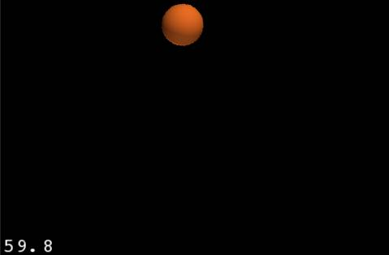
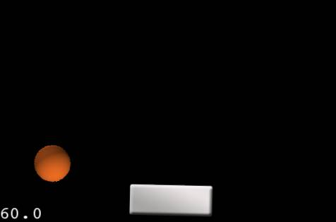
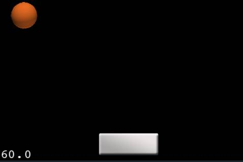

# 如何使用cocos2d-x3.0和物理引擎来制作一个Breakout游戏：第一部分

## 前言

在这个教程中，我们将一步一步创建一个简单的breakout游戏，完成碰撞检测，篮球反弹物理效果，通过touch拖动paddle（就是上图的白色矩形），以及胜利/失败的场景。

如果你还不了解cocos2d-x和其封装的物理引擎，你可能先要读一读[《如何用cocos2d-x3.0制作一款简单的游戏》](http://www.cnblogs.com/andyque/archive/2011/03/22/1990716.html)以及[《在cocos2d-x3.0里面如何使用物理引擎：弹球》这些教程](http://www.cnblogs.com/andyque/archive/2011/05/27/2059453.html)。

好了，是时候制作breakout了！

## 一个永远反弹的球

首先创建一个空项目。

接下来，在HelloWorldScene.h中添加以下成员变量：

	Sprite* ball;
	Sprite* paddle;
	Sprite* edgeSp;

	PhysicsWorld* m_world;

	void setPhyWorld(PhysicsWorld* world){ m_world = world; };

然后，在init方法中加入下列代码：

	auto visibleSize = Director::getInstance()->getVisibleSize();
	auto origin = Director::getInstance()->getVisibleOrigin();

	
    
	edgeSp = Sprite::create();
	auto boundBody = PhysicsBody::createEdgeBox(visibleSize, PHYSICSBODY_MATERIAL_DEFAULT, 3);
	boundBody->getShape(0)->setRestitution(1.0f);
	boundBody->getShape(0)->setFriction(0.0f);
	boundBody->getShape(0)->setDensity(1.0f);
	edgeSp->setPosition(Point(visibleSize.width / 2, visibleSize.height / 2));
	edgeSp->setPhysicsBody(boundBody);
	this->addChild(edgeSp);
	edgeSp->setTag(0);

好，这个代码和我们上一个教程中，为整个屏幕创建一个盒子边界差不多。然后，这一次，我们把重力设置为0，因为，在我们的breakout游戏中，我们并不需要重力！

让我们往场景里面添加一个精灵并为其创建body。紧接着上面的代码，加入下面的代码片段：

	ball = Sprite::create("Ball.png", Rect(0, 0, 52, 52));
	ball->setPosition(100, 100);
	auto ballBody = PhysicsBody::createCircle(ball->getContentSize().width / 2.);
	ballBody->getShape(0)->setRestitution(1.0f);
	ballBody->getShape(0)->setFriction(0.0f);
	ballBody->getShape(0)->setDensity(1.0f);
	ballBody->setGravityEnable(false);
	Vect force = Vect(1000000.0f, 1000000.0f);
	ballBody->applyImpulse(force);
	ball->setPhysicsBody(ballBody);
	ball->setTag(1);
	this->addChild(ball);

注意，我们设置这些参数有一点点不一样了：我们把回复力（restitution）设置为1.0，这意味着，我们的球在碰撞的时候，将会是完全弹性碰撞。

注意，我们也把球的摩擦力设置为0.这样可以防止球在碰撞的时候，由于摩擦损失能量，导致来回碰撞的过程中会有一点点偏差。

	Vect force = Vect(1000000.0f, 1000000.0f);
	ballBody->applyImpulse(force);

这里往球上面施加了一个冲力（impulse），这样可以让它初始化的时候朝一个特定的方向运动。

好了，让我们试一下吧。编译并运行工程，你将会看到一个球无限地在屏幕里面来回弹！----很酷吧！

## 增加 Paddle

如果没有一个paddle的话，那么就不可能称其为一个breakout游戏。

在init方法中构建paddle body：

	paddle = Sprite::create("Paddle.png");
	auto paddleBody = PhysicsBody::createBox(paddle->getContentSize(), PHYSICSBODY_MATERIAL_DEFAULT);
	paddleBody->getShape(0)->setRestitution(1.0f);
	paddleBody->getShape(0)->setFriction(0.0f);
	paddleBody->getShape(0)->setDensity(10.0f);
	paddleBody->setGravityEnable(false);
	paddleBody->setDynamic(false);
	paddle->setPosition(visibleSize.width / 2, 50);
	paddle->setPhysicsBody(paddleBody);
	ball->setTag(2);
	this->addChild(paddle);

如果你编译并运行的话，你将会看到屏幕中间有一个paddle，而且球碰到它将会反弹。

## 移动Paddle

移动paddle需要touch事件，所以先在onEnter方法中允许touch和监听碰撞事件（后面会用到）：

void HelloWorld::onEnter()
{
	Layer::onEnter();

	auto listener = EventListenerTouchOneByOne::create();
	listener->setSwallowTouches(true);

	listener->onTouchMoved = CC_CALLBACK_2(HelloWorld::onTouchMoved, this);

	auto contactListener = EventListenerPhysicsContact::create();
	contactListener->onContactBegin = CC_CALLBACK_2(HelloWorld::onContactBegin, this);
	

	auto dispatcher = Director::getInstance()->getEventDispatcher();

	dispatcher->addEventListenerWithSceneGraphPriority(listener, this);
	dispatcher->addEventListenerWithSceneGraphPriority(contactListener, this);
}

现在，让我们实现touch方法！首先是onTouchMoved：

	void HelloWorld::onTouchMoved(Touch* touch, Event* event)
	{
		Point touchLocation = this->convertToWorldSpace(this->convertTouchToNodeSpace(touch));
		paddle->setPositionX(touchLocation.x);
		
	}

## 限制Paddle的移动

只需要改变paddle的X值就限制了paddle的移动

	paddle->setPositionX(touchLocation.x);

编译并运行，你只能沿关x轴方向移动paddle，这正是我们想要的，不是吧？

## 给我源代码！

　　这里是本教程的[完整源代码](./breakout1.zip)

　　这里是本教程的完整源代码。这只是一部分，第二部分的教程会包含一个完整的breakout的源码。

接下来呢？

　　目前为止，我们已经有一个篮球在屏幕四周来回反弹了，同时还有一个paddle可以用鼠标来控制其移动。在下个教程中，我们将创建一些方块，当球碰到它们的时候，方块就会消失。当然，还有游戏胜利和失败的逻辑！)。这只是一部分，第二部分的教程会包含一个完整的breakout的源码。

## 接下来呢？

目前为止，我们已经有一个篮球在屏幕四周来回反弹了，同时还有一个paddle可以用鼠标来控制其移动。在下个教程中，我们将创建一些方块，当球碰到它们的时候，方块就会消失。当然，还有游戏胜利和失败的逻辑！

