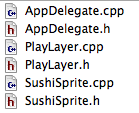
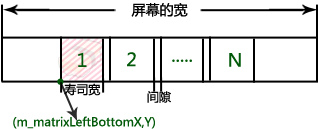
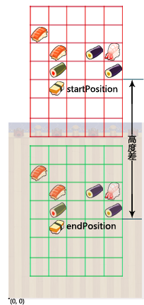

# 使用Cocos2d-x制作三消类游戏Sushi Crush——第一部分

一直以来，消除类游戏以其简单明快的节奏、浓厚的趣味性和智慧性而被广大玩家所喜爱。其分支三消类游戏更是倍受广大游戏玩家的推崇，最近的CandyCrush、开心消消乐、天天爱消除等三消游戏🔥火的那是一个一塌糊涂啊。下面，我们就将和大家一起探讨一下如何制作一款属于自己的仿CandyCrush三消游戏——“SushiCrush”。

## 项目介绍
引擎版本：本教程使用当前最新版本的 Cocos2d-x-3.0rc0 引擎。

效果图：          


游戏框架：为了使项目的代码结构清晰，好的前期规划是很有必要的，下图是该节游戏工程的主要类结构，先从整体看一下，项目的组织结构，然后我们会对其内部实现做些解说。



其中：

- AppDelegate.cpp：程序入口，分辨率适配设置。
- PlayLayer.cpp：游戏场景层，游戏中所有的Node节点都在其内，它同时负责管理SushiSprite。
- SushiSprite.cpp：寿司精灵层，即游戏中可被消除和操作的对象。

在本章节教程中，我们将主要完成以下功能：      

- 分辨率适配      
- 寿司的创建、布局和下落

## 程序入口

AppDelegate.cpp是Cocos2d-x自动生成的一个类，它控制着游戏的生命周期，是Cocos2d-x游戏的通用入口文件，类似于一般 Windows 工程中主函数所在的文件。打开AppDelegate.cpp文件，在applicationDidFinishLaunching()函数中我们可以设置第一个启动的游戏场景：

	auto scene = PlayLayer::createScene();
    director->runWithScene(scene);
    
### 分辨率适配

为了能更好的适应各种分辨率大小和屏幕宽高比的移动终端设备，游戏的开始，我们还是先来看看分辨率的适配设置。      
打开AppDelegate.cpp文件，在applicationDidFinishLaunching函数里面添加如下代码，以便我们的游戏，能够更好的适应不同的运行环境。

	// 分辨率适配
	glview->setDesignResolutionSize(320.0, 480.0, ResolutionPolicy::FIXED_WIDTH);
    std::vector<std::string> searchPath;
    searchPath.push_back("w640");
    CCFileUtils::getInstance()->setSearchPaths(searchPath);
    director->setContentScaleFactor(640.0 / 320.0);

设计分辨率是通过setDesignResolutionSize(width,  height, resolutionPolicy)方法来设置的，第一，二个参数分别是设计分辨率的宽度和高度，第三个参数是你想要的模式。这里设置的分辨率大小是开发时为基准的屏幕分辨率大小。

模式有五种：

- EXACT_FIT 整个游戏内容都会在屏幕内可见，并且不用提供比例系数。x,y会被拉伸，使内容铺满屏幕，所以可能会出现形变，所有的应用程序看起来可能会是拉伸或者压缩的。
- NO_BORDER 一个方向铺满屏幕，另外一个方向超出屏幕，不会变形，但是可能有一些裁剪。
- SHOW_ALL  该模式会尽可能按原始宽高比放大游戏世界，同时使得游戏内容全部可见。内容不会形变，不过可能会出现两条黑边，即屏幕中会有留白。
- FIXED_WIDTH 该模式会横向放大游戏世界内的内容以适应屏幕的宽度，纵向按原始宽高比放大。
- FIXED_HEIGHT 与上一中模式相反。

setSearchPaths()方法设置资源搜索路径，这里w640是搜索的文件夹名。
setContentScaleFactor()方法设置内容缩放因子，顾名思义，就是设置整个游戏内容放大或者缩小的比例系数。

## 寿司精灵 SushiSprite

SushiSprite类继承于Sprite，用来创建单个的寿司精灵，下面是它的类定义：

```cpp
class SushiSprite :  public Sprite
{
public:
	static SushiSprite *create(int row, int col);// 随机创建不同种类的寿司精灵
	static float getContentWidth();// 得到精灵图片的宽（精灵图片为正方形，宽等于高），方便后面计算精灵在场景中的位置。
	// 暂时没用到，在下一节的教程中我们将用来定位行列。
	CC_SYNTHESIZE(int, m_row, Row);
	CC_SYNTHESIZE(int, m_col, Col);
	CC_SYNTHESIZE(int, m_imgIndex, ImgIndex);
};
```

CC_SYNTHESIZE的定义如下：
```
#define CC_SYNTHESIZE(varType, varName, funName)\
protected: varType varName;\
public: virtual varType get##funName(void) const { return varName; }\
public: virtual void set##funName(varType var){ varName = var; }
```

CC_SYNTHESIZE的作用是定义一个保护型的变量，并声明一个`getfunName`函数和`setfunName`函数，你可以用`getfunName`函数得到变量的值，用`setfunName`函数设置变量得值。        
参数varType是变量的类型，`m_row`是变量名，funName是要声明函数的“后半截”名字，如：`CC_SYNTHESIZE(int, m_row, Row)`的作用是声明一个int型的`m_row`变量和一个函数名为`getRow`以及`setRow`的函数。
	
寿司精灵的创建：
```cpp
SushiSprite *SushiSprite::create(int row, int col)
{
	SushiSprite *sushi = new SushiSprite();
	sushi->m_row = row;
	sushi->m_col = col;
	sushi->m_imgIndex = arc4random() % TOTAL_SUSHI;
	sushi->initWithSpriteFrameName(sushiNormal[sushi->m_imgIndex]);
	sushi->autorelease();
	return sushi;
}
```

`arc4random()`方法获取随机数比较精确，并且不需要生成随即种子，`arc4random() % TOTAL_SUSHI`是获得 0 ～ TOTAL_SUSHI － 1之间的整数。

## 游戏主场景 PlayLayer

PlayLayer是游戏的主场景，同时也负责管理SushiSprite，在该章教程中，PlayLayer里我们只实现了寿司的布局和它的下落。下面我们会详细讲解，先看看PlayLayer的初始化：

```cpp
bool PlayLayer::init()
{
	if (!Layer::init()) 
	{
		return false;
	}    
    	
	// 创建游戏背景
	Size winSize = Director::getInstance()->getWinSize();
	auto background = Sprite::create("background.png");
	background->setAnchorPoint(Point(0, 1));
	background->setPosition(Point(0, winSize.height));
	this->addChild(background);
    
	// 初始化寿司精灵表单
	SpriteFrameCache::getInstance()->addSpriteFramesWithFile("sushi.plist");
	spriteSheet = SpriteBatchNode::create("sushi.pvr.ccz");
	addChild(spriteSheet);
    
	// 初始化矩阵的宽和高，MATRIX_WIDTH、MATRIX_HEIGHT通过宏定义
	m_width = MATRIX_WIDTH;
	m_height = MATRIX_HEIGHT;
    
	// 初始化寿司矩阵左下角的点
	m_matrixLeftBottomX = (winSize.width - SushiSprite::getContentWidth() * m_width - (m_width - 1) * SUSHI_GAP) / 2;
	m_matrixLeftBottomY = (winSize.height - SushiSprite::getContentWidth() * m_height - (m_height - 1) * SUSHI_GAP) / 2;
    
	// 初始化数组
	int arraySize = sizeof(SushiSprite *) * m_width * m_height;//数组尺寸大小
	m_matrix = (SushiSprite **)malloc(arraySize);//为m_matrix分配内存，这里m_matrix是指向指针类型的指针，其定义为：SushiSprite **m_matrix。所以可以理解为m_matrix是一个指针数组
	memset((void*)m_matrix, 0, arraySize);//初始化数组m_matrix
    
	//初始化寿司矩阵
	initMatrix();
	return true;
}
```

上面的初始化函数中有以下几点需要说明一下：

- plist 和 pvr.ccz文件
- SpriteFrameCache和SpriteBatchNode
- 寿司矩阵起始点的初始化    
- 寿司精灵如何布局


### 1. plist 和 pvr.ccz文件       

游戏中一般会有比较多的图片资源，如果有很多很多的资源，那加载这些资源是非常费时间和内存的，所以如何高效地使用图片资源对于一款游戏是相当重要的。在Cocos2d中，我们一般会将图片资源打包成一张大图，这样加载图片不仅节省了空间，而且还提升了速度。

在Cocos2d-x引擎开发中，常又到的两种图片编辑打包工具，即 Zwoptex 和 Texturepacker。我们的教程里用到的是Texturepacker，你可以到它的[官方网站](http://www.codeandweb.com/texturepacker/download)下载并安装。

打开Texturepacker，界面如下图所示。     
      

Texturepacker工具的每个设置项都给出了相应的提示信息，这里就不一一介绍。接下来，你就可以根据提示把本章节所需要的6张寿司图片资源打包了。导出的时候勾选 output－》Texture format－》zlib compr.PVR，然后单击Publish按钮进行导出，这样就会导出我们需要的plist 和 pvr.ccz文件了。          
   

plist文件是图片信息的属性列表文件。

PVR图像是专门为ios设备上面的PowerVR图形芯片指定的图像容器。它们在ios设备上非常好用，因为可以直接加载到显卡上面，而不需要经过中间的转化。pvr.ccz文件则是pvr文件格式的压缩格式，使用这种图片格式的好处有两点：1、可以使你的应用程序更小，因为图片是被压缩过了的。2、你的游戏能够启动地更快。
	
### 2. SpriteFrameCache和SpriteBatchNode

上面，我们用TexturePacker工具打包生成了plist和pvr.ccz文件，那么下一步，我们就该获取plist中的信息了。       
Cocos2d中SpriteFrameCache通常用来处理plist文件，并能与SpriteBatchNode结合使用来达到批处理渲染精灵的目的。

- 精灵帧缓存类SpriteFrameCache       
精灵帧缓存类SpriteFrameCache 用来存储精灵帧，缓存精灵帧有助于提高程序的效率。 SpriteFrameCache是一个单例模式，不属于某个精灵，是所有精灵共享使用的。

- 精灵批处理节点SpriteBatchNode      
当你需要渲染显示两个或两个以上相同的精灵时，如果逐个渲染精灵，每一次渲染都会调用 OpenGL ES 的 draw 函数，这样做自然降低了渲染效率。不过幸好，Cocos2d为开发者提供了一个SpriteBatchNode类，它能一次渲染多个精灵。并可以用来批处理这些精灵，比如我们游戏中的寿司精灵。**用SpriteBatchNode作为父层来创建子精灵，并且使用它来管理精灵类，这样可以提高程序的效率。**

在init()方法中调用SpriteFrameCache的addSpriteFramesWithFile方法，传入plist文件名称，它会从plist属性列表文件的元数据部分获取各个纹理的纹理名，载入到纹理缓存中。并解析属性列表文件，使用SpriteFrame对象来内部地跟踪所有精灵的信息。

**在Cocos2d中高效使用图片总结：**

使用TexturePacker打包图片成pvr.ccz文件，使用SpriteBatchNode优化绘制，使用SpriteFrameCache缓存读取，使用spriteWithFrameName获取单张图片。

### 3. 寿司矩阵起始点的初始化         
在游戏中，我们用来存储SushiSprite的数据结构是一个指针数组，其实它也就相当于一个矩阵。寿司矩阵的起始点其实就是寿司精灵开始布局的起始点，在我们的游戏教程中，它位于屏幕的左下角，它由左下角的点开始逐行逐列的初始化寿司精灵。计算该点的公式如下：

	m_matrixLeftBottomX = (winSize.width - SushiSprite::getContentWidth() * m_width - (m_width - 1) * SUSHI_GAP) / 2;
	m_matrixLeftBottomY = (winSize.height - SushiSprite::getContentWidth() * m_height - (m_height - 1) * SUSHI_GAP) / 2;

其原理可简单描述为下图所示的过程（只以计算m_matrixLeftBottomX的值为例，即X轴方向坐标值）：       
         
看原理图其实就已经一目了然了，上图N代表的是横向布局的寿司精灵数，m_matrixLeftBottomX的值 ＝ （ 屏幕的宽 － 寿司的宽＊N个寿司 － （ N-1 ）＊寿司之间的间隙） ／ 2。

### 4. 如何布局

加载完寿司精灵图片，计算好寿司精灵布局的起始点以后，我们就可以开始寿司精灵的布局和它的下落显示了，下面是代码行：

```cpp
// 矩阵的初始化
void PlayLayer::initMatrix()
{
	for (int row = 0; row < m_height; row++) 
	{
		for (int col = 0; col < m_width; col++) 
		{
			createAndDropSushi(row, col);
		}
	}
}	

// 创建SushiSprite，并下落到指定位置
void PlayLayer::createAndDropSushi(int row, int col)
{
	Size size = Director::getInstance()->getWinSize();

	SushiSprite *sushi = SushiSprite::create(row, col);
    
	// 创建并执行下落动画
	Point endPosition = positionOfItem(row, col);
	Point startPosition = Point(endPosition.x, endPosition.y + size.height / 2);
	sushi->setPosition(startPosition);
	float speed = startPosition.y / (2 * size.height);
	sushi->runAction(MoveTo::create(speed, endPosition));
    	
	// 将寿司添加到精灵表单里。注意，如果没有添加到精灵表单里，而是添加到层里的话，就不会得到性能的优化。
	spriteSheet->addChild(sushi);
    	
	// 给指定位置的数组赋值
	m_matrix[row * m_width + col] = sushi;
}

// 得到对应行列精灵的坐标值
Point PlayLayer::positionOfItem(int row, int col)
{
	float x = m_matrixLeftBottomX + (SushiSprite::getContentWidth() + SUSHI_GAP) * col + SushiSprite::getContentWidth() / 2;
	float y = m_matrixLeftBottomY + (SushiSprite::getContentWidth() + SUSHI_GAP) * row + SushiSprite::getContentWidth() / 2;
	return Point(x, y);
}
```

我们先来看怎样获取指定行列精灵在屏幕上的坐标值，即positionOfItem(row, col)方法的实现。同样附上原理图，方便理解。     
    
上图矩阵的起始点已知（m_matrixLeftBottomX，m_matrixLeftBottomY），计算第row行col列的寿司精灵的坐标值。        
需要说明的是，精灵图片的锚点默认在图片的中心位置，锚点关系到纹理贴图的位置。例如：如果把一个精灵设置在（0，0）点的位置，那么它的锚点也就会和（0，0）点重合，在屏幕上也就只能显示四分之一的精灵。所以往往为了避免这种问题，在贴精灵图片的时候我们会加上它宽高的一半。      
言归正传，结合上面的原理图，你将很容易理解（x, y）是如何计算的。

最后，寿司精灵的创建和下落方法：createAndDropSushi(row, col)。
寿司精灵的创建一幕了然，它的下落是通过让寿司精灵执行MoveTo动作来实现的，具体方法是把寿司精灵的起点设置在比终点（可以通过positionOfItem方法获取）高size.height / 2的地方，再让其以一定的速度从起点移动到终点。原理如下图所示：



## where to go

至此，我们第一章的内容久讲完了。

本节代码下载地址：[https://github.com/iTyran/SushiCrush/tree/Part1](https://github.com/iTyran/SushiCrush/tree/Part1)

在下一章中，我们将实现初次掉落的消除检查，并自动消除三个连在一起的寿司，然后掉落新的寿司补齐空缺。
