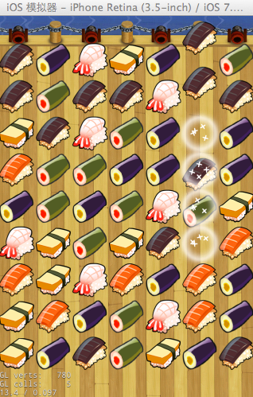
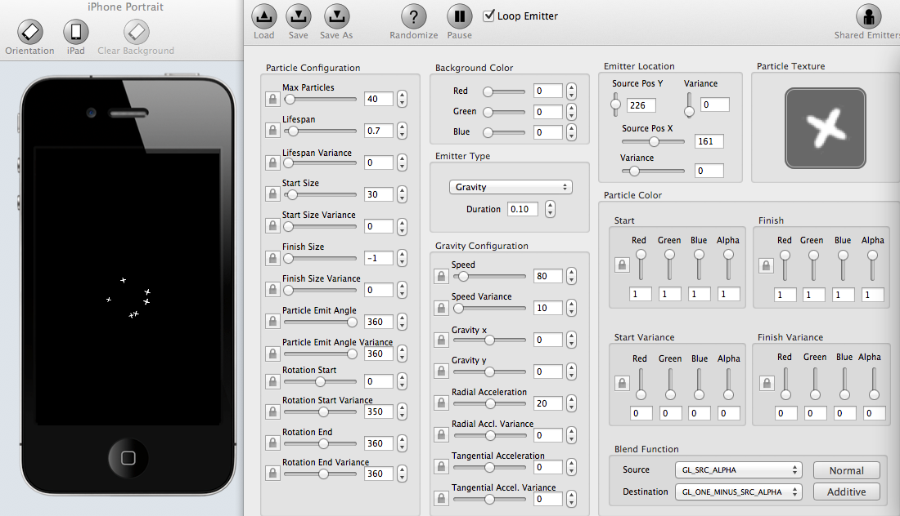

# 使用Cocos2d-x制作三消类游戏Sushi Crush——第二部分

## 本章介绍
在上一节[《使用Cocos2d-x制作三消类游戏Sushi Crush——第一部分》](http://www.ityran.com/archives/5839)中，我们完成了分辨率的适配和寿司精灵的创建、布局、下落。按照三消游戏的游戏制作流程，接下来我们实现寿司精灵的消除操作。本节中我们将设计整个游戏的主要逻辑算法，其中包含以下内容:

- 消除寿司的条件检测
- 消除寿司
- 消除寿司时的特效
- 填补消除寿司后留下的空位

效果图：      


实现之前先来整理整理逻辑！寿司精灵下落后，同行或同列如果有三个或三个以上相同的寿司精灵，那么应该首先判断并将其消除。而按照常理，在寿司下落过程中是不能进行消除操作的，所以我们要先定义一个变量，判断是否有精灵处于下落状态（即runAction是否完成）。如全部都落到了指定位置，则开始检测是否有满足消除条件的寿司，如有，则将其消除并“播放”爆炸特效，同时新建寿司精灵填补空位。游戏流程如下：
     


整理好逻辑后，现在就开始我们的工作吧。       

## 游戏主逻辑
对于一个游戏而言，只存在场景、层、精灵等实际的元素往往是不够的，我们需要对这些元素进行必要的逻辑检测和处理，例如精灵的移动、碰撞、动作等等。而且这些逻辑检测一般情况下是需要及时做出反馈的，所以我们需要在某个方法中不停地循环执行这些逻辑。        

Cocos2dx游戏中，游戏的每一帧都会调用Scheduler的update来调度定时器；然后遍历渲染树，对游戏画面进行绘制。所以我们可以重写update方法实现自己游戏的逻辑检测和处理，下面就是update的代码部分：

```
void PlayLayer::update(float dt)
{
    // 检测游戏场景中是否有Actions
    if (m_isAnimationing) {
        // 初始化m_isAnimationing
        m_isAnimationing = false;
        //依次检测每个寿司，看它们是否正在执行某个Action
        for (int i = 0; i < m_height * m_width; i++) {
            SushiSprite *sushi = m_matrix[i];
            if (sushi && sushi->getNumberOfRunningActions() > 0) {
                m_isAnimationing = true;//如果sushi正在执行Action，那m_isAnimationing就为真。
                break;
            }
        }
    }
    //当没有任何寿司执行Action时，检测和删除满足消除条件的寿司
    if (!m_isAnimationing) {
        checkAndRemoveChain();
    }
}
```
m_isAnimationing 变量好比一把程序锁，当精灵们都乖乖的不动时，程序就会开启它，让你可以安心地执行消除检测工作；当有精灵调皮的时候，程序便会锁上它，避免你在这过程中对精灵"胡作非为"。                            
getNumberOfRunningActions()方法可以获取sushi正在执行中的动作个数，如果值大于0，那证明此刻的sushi正处于“调皮”状态。

update完成了游戏中最重要的逻辑部分，即下图粉色部分的内容，checkAndRemoveChain方法中实现蓝色部分的内容：


    
**如果要调用update，必须在程序中调用scheduleUpdate()定时器。**           
首先，什么是定时器呢？从字面上我们可以把它理解为能在特定的时间段里控制处理某项任务的装置。然而事实上，在Cocos2dx中它的功能也的确如此。当你想让某个函数不断的执行，或每隔几秒执行一次，或只执行一次时，那么这些都可以统统交给定时器来完成。

cocos2dx中有三种定时器：schedule，scheduleUpdate，scheduleOnce。了解了其功能你便会发现定时器真是很简单，很方便，下面是它们的异同：        
1. scheduleUpdate();   此函数是Node的成员函数，每个Node只要调用scheduleUpdate()，那么这个Node就会自动刷新当前类的update(float dt)函数体。scheduleUpdate()默认每一帧都会调用update函数。
2. schedule的作用与scheduleUpdate()函数相似，但是scheduleUpdate()默认每一帧都会调用update函数，而schedule则可以自定义刷新的函数体和时间间隔。
	- [1]schedule(selector);  参数：目标函数，即自定义的更新函数。该函数等同于scheduleUpdate，默认每一帧都调用目标函数。
	- [2]schedule(selector, interval);  参数：目标函数，更新时间。
	- [3]schedule(selector, interval, repeat, delay);  参数：目标函数，更新时间，更新次数，每次等待时间。
3. scheduleOnce(selector, delay);  参数：目标函数，等待时间。只执行一次，可以指定刷新的函数体。

停用定时器的方法：       
1. 停止默认的update更新函数。      
unscheduleUpdate();
2. 停止自定义更新函数。          
unschedule(selector); 参数：自定义的更新函数。
3. 停止所有更新函数。          
unscheduleAllSelectors()

## 检测
检测是否有符合消除条件的精灵对象是三消类游戏必不可少的过程，也是最重要的逻辑算法部分之一。

在游戏中，我们检测寿司能不能被消除可以这样做——从寿司矩阵中选取一个寿司，分别查找它的上下、左右是否有与它相邻并且图标相同的寿司存在，如存在，则把它们插入到某个列表中，等待进一步的消除操作。

以横轴上的寿司为例，其原理可用下图所示图形来作描述：


在水平方向上以sushi所在的列数为界点，分别向前向后依次检查是否有精灵的图标与sushi的图标相同，如果有相同的，这把它插入chainList列表中。      

其算法如下：

```
//横向chain检查
void PlayLayer::getColChain(SushiSprite *sushi, std::list<SushiSprite *> &chainList)
{
    chainList.push_back(sushi);// 插入第一个寿司精灵
    
    //向前检测相同图标值（ImgIndex）的寿司
    int neighborCol = sushi->getCol() - 1;//sushi前一列寿司所在列数值
    while (neighborCol >= 0) {
        SushiSprite *neighborSushi = m_matrix[sushi->getRow() * m_width + neighborCol];
        if (neighborSushi && (neighborSushi->getImgIndex() == sushi->getImgIndex())) {
            chainList.push_back(neighborSushi);//插入该“邻居”寿司
            neighborCol--;//继续向前
        } else {
            break;
        }
    }
    //向后检测相同图标值（ImgIndex）的寿司
    neighborCol = sushi->getCol() + 1;
    while (neighborCol < m_width) {
        SushiSprite *neighborSushi = m_matrix[sushi->getRow() * m_width + neighborCol];
        if (neighborSushi && (neighborSushi->getImgIndex() == sushi->getImgIndex())) {
            chainList.push_back(neighborSushi);
            neighborCol++;
        } else {
            break;
        }
    }
}
```

在getColChain(sushi, chainList)方法中，sushi是传入的待检测寿司精灵，chainList是存放与sushi相邻并拥有相同图标值（ImgIndex，它决定精灵的种类）的寿司的寿司列表。

纵轴上检测原理相似，这里就不做过多描述。

## 消除寿司
消除寿司之前，需要先判断并取得可被消除寿司的寿司列表，然后依次取出寿司列表的值把它置为空。  
     
消除算法如下：

```
void PlayLayer::removeSushi(std::list<SushiSprite *> &sushiList)
{
    m_isAnimationing = true;
    
    std::list<SushiSprite *>::iterator itList;
    //依次取出sushiList的值
    for (itList = sushiList.begin(); itList != sushiList.end(); itList++) {
        SushiSprite *sushi = (SushiSprite *)*itList;
        // 从m_matrix中移除sushi
        m_matrix[sushi->getRow() * m_width + sushi->getCol()] = NULL;
        explodeSushi(sushi);
    }
    
    // 填补空位，它根据NULL的m_matrix值计算填补位置
    fillVacancies();
}
```


## 消除特效
在消除类游戏中，消除精灵的同时一般都会伴有炫丽的爆炸特效，这样才能吸引玩家的眼球，所以我们也仿照CandyCrush的消除特效制作了一个简单的特效。特效由三部分组成：逐渐变小并消失的寿司，逐渐增大并消失的光圈，随机的粒子效果。      
第一二部分特效都可以通过让寿司精灵执行Action来实现，具体方法如下：

```    
// 1. 寿司Action－逐渐变小
sushi->runAction(Sequence::create(
                                 ScaleTo::create(time, 0.0),
                                 CallFunc::create(CC_CALLBACK_0(Sprite::removeFromParent, sushi)),
                                 NULL));//执行完ScaleTo动作后将sushi从父节点移除
    
// 2. 圆圈⭕️特效
auto circleSprite = Sprite::create("circle.png");
addChild(circleSprite, 10);
circleSprite->setPosition(sushi->getPosition());
circleSprite->setScale(0);// start size
circleSprite->runAction(Sequence::create(ScaleTo::create(time, 1.0),    
                                         CallFunc::create(CC_CALLBACK_0(Sprite::removeFromParent, circleSprite)),
                                         NULL));//执行完ScaleTo动作后将circleSprite从父节点移除

```

这里CallFunc方法是一个动作回调，它派生自ActionInstant类，其实就属于瞬时动作的一种，作用是回调某个类中的方法。Cocos2d-x内部使用大量的回调函数来进行消息传递（或者说事件调用）。例如：Menu的事件触发，定时器的触发，Action结束时的回调等等。CallFunc就是属于Action结束时的回调。        

当一个Node执行完某个Action后，我们可能需要做一些其他的工作（比如从场景移除这个Node），这时就可以使用动作回调函数来完成这项功能。在SushiCrush特效中，当Sprite执行完ScaleTo动作后，需要将该Sprite从父节点中移除，所以这里我们需要用到动作回调。

CC_CALLBACK_0是一个宏定义，其定义使用来C++11的特性，定义如下：          
`#define CC_CALLBACK_0(__selector__,__target__, ...) std::bind(&__selector__,__target__, ##__VA_ARGS__)`

如果你对回调函数和C++11特效不太了解，推荐阅读： [Cocos2d-x 3.0 新特性体验－回调函数的变化](http://www.ityran.com/archives/5882)和            
[C++11 语法记录](http://www.ityran.com/archives/5898)两篇文章。
 
###粒子特效

Cocos2d-x引擎提供了强大的粒子系统，它在模仿自然现象、物理现象及空间扭曲上具备得天独厚的优势，为我们实现一些真实自然而又带有随机性的特效（如爆炸、烟花、水流）提供了方便。所以SushiCrush爆炸特效的第三部分我们可以利用粒子系统来实现，代码如下：

```
// 3. 粒子特效
auto particleStars = ParticleSystemQuad::create("stars.plist");
particleStars->setAutoRemoveOnFinish(true);
particleStars->setBlendAdditive(false);
particleStars->setPosition(sushi->getPosition());
particleStars->setScale(0.3);
addChild(particleStars, 20);
```

ParticleSystemQuad是用于创建粒子系统的类，我们可以通过调用它的create方法来创建一个粒子系统。    
  
Cocos2d-x中粒子系统是一个很强大的功能，但因为它有非常多的属性需要设置和调节，所以使用起来还是有些复杂。

不过你也不用担心，俗话说兵来将挡，水来土掩，程序员也不是省油的灯。为了能偷懒，我们伟大的程序员开发了粒子编辑器，它可以很方便的编辑出漂亮的粒子效果，让你勉去手动设置粒子属性的过程。程序中stars.plist文件就是由粒子编辑器编辑生成的。    

常用的粒子编辑器有两种，一种是ParticleDesigner，另一种是ParticleEditor。尽管ParticleDesigner编辑器要比ParticleEditor美观的多，但就我个人而言，我还试觉得ParticleEditor更好用一些，它比较适合新手。之前我也写过一篇关于[如何使用ParticleEditor编辑器](http://www.ityran.com/archives/5496)相关的文章，大家可以参考一下。不过不管怎样，粒子编辑器的使用一般都大同小异，比较简单，所以这里就不做赘述了。

教程中我们所用的粒子编辑器是ParticleDesigner，如下图所示：

     

> 提示：ParticleDesigner不支持Windows系统，所以如果你是Windows系统，最好还是选择使用ParticleEditor吧。
    
## 填补空位

消除寿司后，会留下很多空位，所以接下来我们要把空缺的位置给填补上。    
填补空缺的寿司矩阵位置可以分为两个过程：1、让空缺处上面的寿司精灵依次“落”到空缺处 2、创建新的寿司精灵并让它“落”到矩阵最上方空缺的位置。     
原理如下所示：     
   

下面是代码部分：

```
void PlayLayer::fillVacancies()
{
    Size size = CCDirector::getInstance()->getWinSize();
    int *colEmptyInfo = (int *)malloc(sizeof(int) * m_width);
    memset((void *)colEmptyInfo, 0, sizeof(int) * m_width);
    
    // 1. 让空缺处上面的寿司精灵向下落
    SushiSprite *sushi = NULL;
    for (int col = 0; col < m_width; col++) {
        int removedSushiOfCol = 0;//记录一列中空缺的精灵数
        // 从下向上
        for (int row = 0; row < m_height; row++) {
            sushi = m_matrix[row * m_width + col];
            if (NULL == sushi) {
                removedSushiOfCol++;
            } else {
                if (removedSushiOfCol > 0) {
                    //计算寿司精灵的新行数
                    int newRow = row - removedSushiOfCol;
                    // 转换
                    m_matrix[newRow * m_width + col] = sushi;
                    m_matrix[row * m_width + col] = NULL;
                    // 移动到新位置
                    Point startPosition = sushi->getPosition();
                    Point endPosition = positionOfItem(newRow, col);
                    float speed = (startPosition.y - endPosition.y) / size.height;
                    sushi->stopAllActions();// must stop pre drop action
                    sushi->runAction(CCMoveTo::create(speed, endPosition));
                    // 设置寿司的新行
                    sushi->setRow(newRow);
                }
            }
        }
        
        // 记录col列上空缺数
        colEmptyInfo[col] = removedSushiOfCol;
    }
    
    // 2. 创建新的寿司精灵并让它落到上方空缺的位置
    for (int col = 0; col < m_width; col++) {
        for (int row = m_height - colEmptyInfo[col]; row < m_height; row++) {
            createAndDropSushi(row, col);
        }
    }
    
    free(colEmptyInfo);
}
```
结合代码中的注释和原理图，它的实现原理是不是一目了然，很简单的吧。

好了，今天就到此为止，敬请期待下一章的教程吧。

## Where to go


本节代码下载地址：[https://github.com/iTyran/SushiCrush/tree/Part2](https://github.com/iTyran/SushiCrush/tree/Part2)

在下一章中，我们将实现触摸控制，四消产生特殊寿司，以及特殊寿司爆炸消除一行或列。