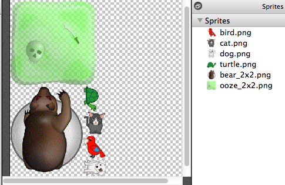
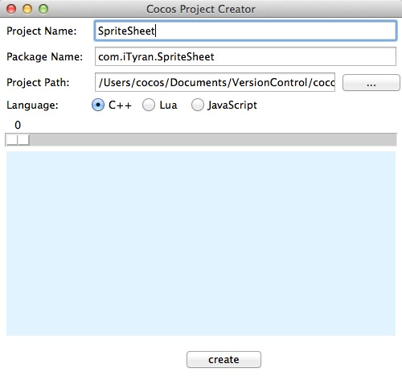
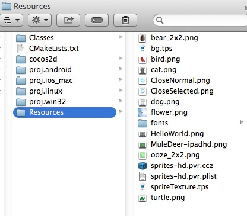
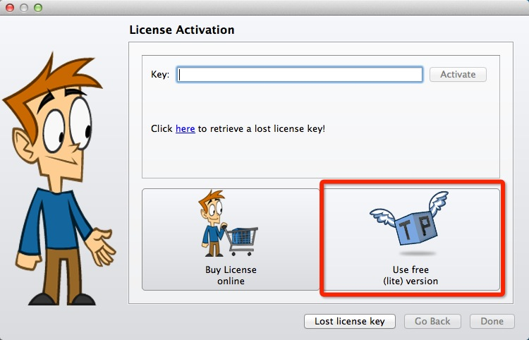
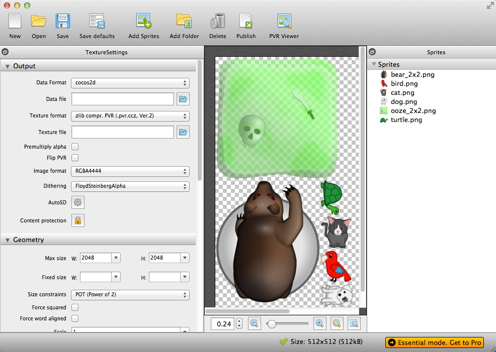
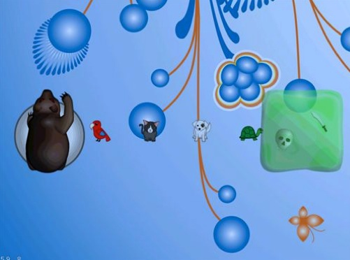

# cocos2d-x里如何用TexturePacker和像素格式来优化spritesheet

## 预备知识

在Cocos2d-x里,为了使你的游戏获得最佳性能,你需要把许多小的 sprite 图片组合到一张大图里面,这张大图就叫做 sprite sheet（精灵表单）。



这里我们将要借助一款叫做**TexturePacker**的工具来创建 sprite sheet。

本教程将讲述如何在基于Cocos2d-x进行游戏开发时使用TexturePacker。同时,你还将学习到**如何使用像素格式(pixel formats)；TexturePacker如何智能地让你的游戏加载速度更快,运行更流畅,而且还能够在游戏界面看起来很不错的前提下使用尽可能少的内存**。
## 开始

硬件环境： MacOS X 10.9.1

开发工具：Xcode5， TexturePacker-3.2.1

引擎版本：[Cocos2d-x-3.0beta](http://cdn.cocos2d-x.org/cocos2d-x-3.0beta.zip)

以上是我的开发环境，你大可根据你的开发环境做相应操作。直接将路径 /cocos2dx-master/tools/project-creator 中的 create_project.py 拖到终端,然后会跳出对话框如下（这是3.0之后才有的，使用之前版本的小伙伴请参考 [cocos2d-x环境搭建（基于win7以及mac）](http://bbs.ityran.com/thread-9157-1-2.html)）:



项目创建完毕。接下来我们需要准备素材制作Sprite Sheet。Demo里用到的[图片资源](http://pan.baidu.com/s/1jGumhOq)已经上传到我的网盘，你可以直接下载获得。下载后将其解压到你所建项目的Resources文件夹下,如下所示：



## 使用TexturePacker来创建spritesheet

你需要做的第一件事情就是下载[TexturePacker](http://texturepacker.com/download/)的免费版本。请注意,你并不需要购买证书,对于这篇教程来说使用免费版本就已经足够了，当然你也可以通过给开发者发邮件获取免费证书，如果你已经有一个很不错的博客的话。

下载完之后双击进行安装,然后点击“TexturePacker-3.2.1.dmg”,接下来就会弹出一个窗口,然后按照提示一步步安装在你的Mac上。


安装完成后，在Application文件夹中找到  并运行它，然后你将会看到如下的欢迎界面，这里我们选择右下方红色框所标识出来的**Use Free**。当然啦，如果你拥有一个高大上的密钥的话直接输入密钥就好（实际上购买密钥的话大概$50左右）。



进入到软件的主界面以后，点击工具栏中的“Add Sprites”选项会跳出一个对话框，选取你所需要的图片导入，如果你需要导入多张图片，你可以通过按下Command键+鼠标点选，一次选取多张图，然后确定导入；当然，如果你的图片存放在一个文件里面，你也可以通过“Add Folder”按钮,然后选择存放这些图片的文件夹整体导入。TexturePacker 将会加载图片并且智能地把这些图片布局在spritesheet中。




btw，你通过增加文件夹的方式增加精灵，TexturePacker并不会对所有精灵增加索引，而是对整个文件夹增加索引。当你下次再向这个文件夹增加精灵的时候，TexturePacker会重新根据文件夹下的所有精力重新创建sprite sheet。

ok,现在来熟悉一下左侧的**TextureSettings**栏：

- **Autosize(默认)** 这个选项会为你的spritesheet挑选最小的2的指数倍的大小。这是一个非常方便的特性,因为它可以省去你自己去计算spritesheet大小的时间。

- **Min/max size** 让你为你的spritesheet指定一个最大值。如果你想设置特定大小的spritesheet的时候,这也是一个非常方便的特性。(因为对于特定的设备来说, 你可不想超过设备能够支持的最大限制,比如2代touch最大支持 texture大小为1024*1024)

- **Scale** 可以用于保存一个比原始图片尺寸要大一点、或者小一点的spritesheet。如果你想在 spritesheet中加载“2x"的图片(也即为Retina-display设备或者ipad创建的)。但是你同时也想为不支持高清显示的iphone和 touch制作spritesheet,这时候只需要设置**scale**为0.5就可以了。也就是说,只需要提供@2x的高清图片,用TP你就可以生成高清和普清的图片。

- **Algorithm** TexturePacker 支持的算法是 MaxRects,即按精灵尺寸大小排列；如果选择 Basic 则表示，当第一行排满之后再排到第二行。

- **Border/shape padding** 即在spritesheet里面,设置精灵与精灵之间的间隔。

- **Extrude** 精灵边界的重复像素个数。这个与间隔是相对应的--如果你的精灵旁边存在一些透明的小点,你可以通过把这个值设置大一点来解决。

- **Trim** 通过移除精灵四周的透明区域使之更好地被放在spritesheet中。不要担心, 这些透明的区域仅仅是为了使 spritesheet 里面的精灵紧凑一点，当你从cocos2d 里面去读取这些精灵的时候,这些透明区域仍然存在。

- **Shape outlines** 把这个选项打开,那么就能看到精灵的边框。这在调试的时候非常有用。

对于spritesheet来说,上面的属性我们只需使用TP的默认值就好。我们只需要在输出时做些修改，讲解这个之前我们先了解下cocos2d-x中的像素格式。

## Cocos2d-x 和像素格式

在cocos2d-x里面,理解像素格式非常重要。因为,像素格式会影响你在游戏中加载一张图片所需内存。游戏通常要加载大量的图片资源,尽可能充分利用移动设备上的可用物理内存对我们来说是很重要的。

默认情况下,当你在cocos2d-x里面加载一张图片的时候,对于每一个像素点使用4个byte来表示。其中1个byte(8位)代表red,另外3个 byte分别代表green、blue和alpha透明通道。这个就简称RGBA8888。

因此,如果你使用默认的像素格式来加载图片的话,你可以通过下面的公式来计算出将要消耗多少内存:
 
图像宽度(width)×图像高度(height)×每一个像素的位数(bytes per pixel) = 内存大小

此时,如果你有一张512×512的图片,那么当你使用默认的像素格式去加载它的话, 那么将耗费 **512×512×4=1MB**

这里,我们以Iphone3G为例。它总共只有128兆内存,但是系统就要占掉一大半,还有其它一些程序也要使用一些内存,实际可用的内存就更少了。对于单独一张 spritesheet 来说那确实足够了，但是一个游戏通常会需要大量内存。

这里就需要让像素格式来帮忙了。为图片的每个像素点指定更小的字节来保存图片。(比如每个像素点2个字节,即每个像素点16位),这种方式就能够在图片质量和内存消耗之间取得一个很好的平衡点。

通常,你是在你的游戏看起来还 ok 的提前下,尽可能少地使用内存。背景图片就非常适合使用8位或者16位来存储,而精灵则一般要用16位或者32位。对于更多可选的像素格式和适用的场合,你可以参考cocos2d的作者的一篇文章[《understanding pixel format guide》](http://www.cocos2d-iphone.org/understanding-pixel-format-in-cocos2d-v0-7-3)(理解像素格式向导)。

btw,如果你注意看窗口的右下角,你会看到TexturePacker会基于你当前选择的像素格式计算出这张spritesheet所消耗的内存大小,因此你不必手动计算了。

## 像素格式和抖动

很多时候,当你使用较小的像素格式来加载图片的时候,你会发现图片的质量也在相应的降低。这时你会看到图像存在许多颜色的梯度变化。这里有一个例子,展示了当你使用像素格式RBGA4444去显示一张图片的时候会是什么样子:



看到没有,图像上面有许许多多的“条条”和颜色梯度变化,特别是熊和绿色的框框那里。这时,你可能想重新设计你的图片来确保使用更少的梯度,或者使用大一点的像素格式。但是,在这里,TexturePacker提供了另外一个杀手锏功能**图像抖动**。

当你使用TexturePacker来保存spritesheet的时候,你可以指定目标像素格式为RGBA4444,然后选择“dithering method”。这个默认选项会修改一些你的图像的颜色,但是当有梯度变化或者其它一些会带来问题的颜色以后,图像看起来就会非常糟糕。

继续,我们为spritesheet选择RBGA4444格式,然后改变抖动选项为“FloydSteinberg +Alpha”(下图红色框区域)。TexturePacker将会动态修改你的图片然后显示出效果来。


现在让我们保存这个spritesheet。点击工具栏顶端的“Save”,在弹出的对话框中选择 TextureFun\Resouces 目录,然后命名为“sprites-hd.pvr.ccz”。然后,TexturePack会自动为我们在Data file那里生成相应的plist文件路径。并且会命名为“sprites-hd.plist”, 这个名字是根据前面你提要的名字来命名的。最后,点击“Publish”,TeturePacker会提示你一些精灵将会创建成红色(因为你使 用的是免费版本)。为什么使用**pvr.ccz**呢？

## PVRs 和压缩
 
PVR 图像也可以包含许多种不同像素格式的图像数据。cocos2d-x可以支持压缩了的 pvr图像格式pvr.ccz。使用这种图片格式的好处有两点:一、可以使你的应用程序更小,因为图片是压缩过了的。二、你的游戏能够启动地更快。

总而言之,对于 spritesheet 来说,你可能通过指定16位的像素格式来减少内存消耗, 同时保存为pvr.ccz格式来使程序加载速度更快。

## 在Cocos2d-x里面使用SpriteSheet

现在回到我们之前创建好的-x项目，在Resources文件中加入我们刚刚生成好的文件**sprites-hd.plist**和**sprites-hd.pvr.ccz**，接下来在**HelloWorldScene.cpp**的**init()**方法中加入相应代码。源码放在github中可供[下载](https://github.com/cuit-zhaxin/ProjectsSpace/tree/master/doc-space/spritesheet)。

首先我们设置像素格式为RBGA4444(你为主精灵所使用的每个像素点16位的像素格式)

```
Texture2D::setDefaultAlphaPixelFormat(Texture2D::PixelFormat::RGBA4444);
```
接下来为这个spritesheet创建一个batch node。加载对应的pvr.ccz格式的文件和plist文件，然后把每一个精灵对应的帧(frame)也加载到精灵帧缓冲区(sprite frame cache)中。

```
Texture2D::setDefaultAlphaPixelFormat(Texture2D::PixelFormat::RGBA4444);
Texture2D *texture2D = Director::getInstance()->getTextureCache()->addImage("sprites-hd.pvr.ccz");
auto spBatchNode = SpriteBatchNode::createWithTexture(texture2D);
addChild(spBatchNode);
SpriteFrameCache::getInstance()->addSpriteFramesWithFile("sprites-hd.pvr.plist");
```

```    
std::vector<std::string> arrSpFrameName = {"bear_2x2.png","bird.png","cat.png","dog.png","ooze_2x2.png","turtle.png"};   
```

显示所有的图片。

```
for(int i = 0;i< arrSpFrameName.size();i++){
	std::string spFrameName = arrSpFrameName.at(i);
	auto sp = Sprite::createWithSpriteFrameName(spFrameName);
	float offsetFaction = ((float)(i+1)/(arrSpFrameName.size()+1));
	Point spriteOffset = Point(visibleSize.width*offsetFaction,visibleSize.height/2);
	sp->setPosition(spriteOffset);
	addChild(sp);
}
```

最终显示的结果是：


