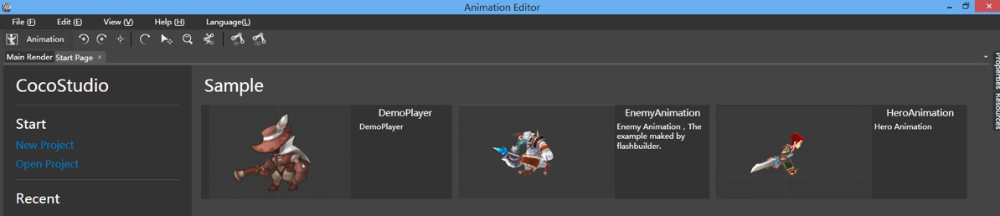

# 시작하기

## CocoStudio 다운로드

CocoStudio 는 저희의 공식 웹사이트에서 다운로드 할 수 있습니다: http://download.cocos2d-x.org/

이번에, 저희는 CocoStudio를 자습할 수 있는 방법을 알려드리고자 합니다. - Cocos2d-html5 버전에서 테스트 하거나, 샘플을 에디터 내에서 편집해볼 수 있습니다. 도움말은 [이곳](http://help.cocostudio.org/)을 참조하세요.

## 내장된 예제를 확인하기

### 테스트 프로젝트 보기

CocoStudio API의 모든 예제들은 Cocos2d-html5 내에서 찾을 수 있습니다. 예를 들어, 스켈레톤 애니메이션의 키 프레임 이벤트를 생성하는 방법을 알고 싶다면, Cocos2d-html5를 실행해 “Test Frame Event” 를 실행합니다. 해당 예제의 코드를 보고 싶다면, 
“Cocos2d-html5/samples/CocoStudioTest/ArmatureTest/ArmatureTest.js” 파일을 열어봅니다.

*그림 2: CocoStudio Test - Test Freame Event*  

*그림 3: ArmatureTest.js*  

### 샘플 데모 보기

여러분이 CocoStudio의 UI 에디터나 애니메이션 에디터, 씬 에디터를 열어보셨다면 시작 페이지에서 샘플 데모들을 확인하셨을것입니다. 이 샘플들을 열어보시면 해당 툴을 시작하는데에 도움이 될 것입니다.

*그림 4: CocoStudio 애니메이션 에디터의 샘플 데모*  
