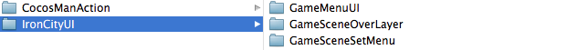
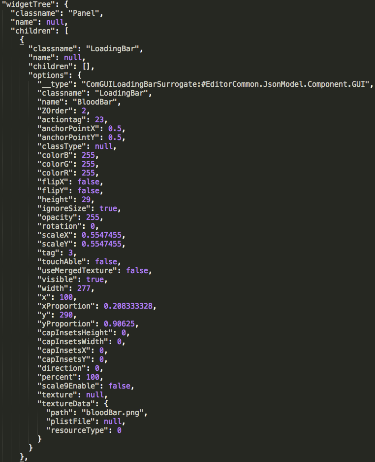
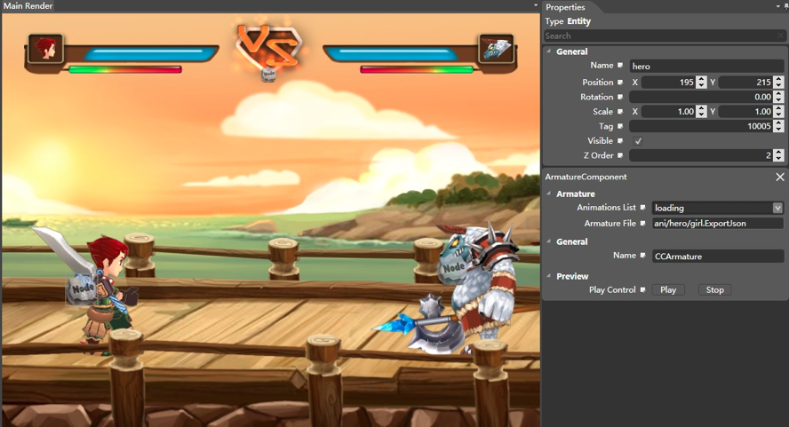

# Let's Build a Parkour Game

## Overview

### The Introduction of IronCity

This is a little simple parkour game to show you how to use CocoStudio in a game. It is called IronCity, made with Cocos2d-html5 and CocoStudio v1.0.2.(CocoStudio released its latest 1.1.0 version during the writing process of this document.) The user interfaces and the animations of IronCity were created with CocoStudio. You can clone it from our github: 
https://github.com/yuye-liu/CocostudioIronCity

IronCity consists of 2 scenes - the main menu scene, and the game scene. It’s a simple shooting game. In the game scene, you can use gestures to control the CocoMan (The main role) to run, jump, stop or shoot. The goal is to run as far as possible, shoot as many monsters as you can - the higher score, the better you do.

*Figure 5: Main Menu Scene*

*Figure 6. Game Scene*

*Figure 7: Code Structure of IronCity*

The screenshot shows the structure of IronCity. We separated the sources into 3 parts.  I will talk about each part in a nutshell with special emphasis on the ones that used CocoStudio.  

- MainMenuScene.js: The beginning scene of IronCity, including a background pictures and a start button. Tap start button and it will change to the next scene: the game scene.

- GameScene.js: The main scene of IronCity. All the constants of resources have been defined here. The game scene has 3 layers: menu layer, play layer and gameover layer. It also controls all the collision detection for the CocoMan.

- Background.js: Create the background map of the game scene. Use tilemap to draw these maps and put them together into a complete background.
  
- GameOver.js: This is a UI layer. When CocoMan dies and the game scene will create the game over layer. The game over layer includes a UI that shows the score of player. The UI in game over layer is made by UI Editor, all of the 3 layers’ UI Editor’s projects can be found in the path “CocoStudioIronCity/IronCityCocoStudioProject/IronCityUI” .

*Figure 8: IronCityUI*

- Laser.js: Laser is CocoMan’s weapon. Once you tap the screen in the game scene, the CocoMan will shoot laser to the touch point. The laser extend cc.Sprite class. In Laser.js, it provides several functions, for example, add or release a laser.

- MenuUI.js: MenuUI is a UI layer, too. It contains 3 basic user interfaces created by UI Editor as a game menu: a blood bar, a distance score and a setting button. This is a very simple example so I will choose this MenuUI to show how to use UI Editor in next section.

- SettingUI.js: SettingUI is a UI layer for setting. If you touch the setting button on the game scene (setting is belong to MenuUI), it will pause the game and create the SettingUI. It can switch off or switch on the music effect, regulate the volume of music , return to the game and back to the main menu scene.

- Monster.js: There are two kinds of monsters in IronCity. The Monster class extends from cc.Node get the functions of generating, destroying, moving the monsters and playing the animations of monsters. The animations of monsters is created by Animation Ediotr. But they are just some pictures’s replacement work, they don’t use any armatures here. So I don’t talk too much about this animations here. Later we will see a complete armature animation in next section.

- Player.js: Player is a class extend from cc.Layer. Player includes an armature called “imManArmature”. This is CocoMan’s armature. The major functions of Player is to load and play 7 animations of CocoMan’s armature. I’m going to talk about the running anmation to show you how to build an armature by Animation Editor.

## Design the Required Game Components

We are going to show how to build users interface and animations through UI Editor and Animation Editor. We didn’t use Scene Editor or Data Editor in the IronCity, you can get help from help documents if you need it. 

We designed and created 3 menus and 9 animations by CocoStudio in IronCity. If you cloned the remote on the github site I just mentioned about, you can find all of these CocoStudio projects in the folder “IronCityCocoStudioProject”.

The 3 menus are called “GameMenuUI”, “GameSceneOverLayer”, “GameSceneSetMenu”.  They refer to the 3 layers in the game scene of IronCity. And the 9 animations like “CMRun” or “CMRunJump” are used to be the animations for CocosMan. In next section, I will choose the “GameMenuUI” and “CMRun” to show how to use UI Editor and Animation Editor.

*Figure 9: CocosManAction*

# A Step by Step Process to Make "GameMenuUI"

## Decide Which Kind of Widgets Shoule be Included

Firstly, decide what is needed in the UI. The “GameMenuUI” of IronCity is easy to draw. Here I want a blood bar, distance score and setting button. I’d  open the CocoStudio, choose the UI Editor, create new project from the file. 

*Figure 10. Imagination of IronCity*

## Put Everything You Need by Adding Widgets

*Figure 11: UI Editor*

This is a screenshot of UI Editor. I have put my resources into the editor by adding widgets. The yellow parts are comments.

The tools provide 8 ways to help you align and 2 ways to rotate. You can set up the resolution of your UI Layer by canvas, which offers several different resolutions. You can see a normal button on the left side of canvas. This button changes UI Editor from normal mode to animation mode. The animation part is almost the same as the animation Editor, and I’d be talking about this in Animation Editor.

There are 14 widgets in the widgets toolbar. I will introduce some of them later. All of the widgets can be dragged into the main render. If you hold down space on keyboard, you can move your canvas on the main render by your mouse. Some of shortcut keys in CocoStudio is similar to that in PhotoShop. Then you pull the picture resource from the Resources Menu into the Properties. In this case, I dragged a “bloodBar.png” to the my bloodBar’s texture. The resources menu supports importing or dragging a .psd file, but the names of the resources should be English.

Here I have added all widgets I need and set up the pictures from resources. The object structure shows the hierarchy of the layer, but that is not the actual order in the game. In Cocos2d-x and Cocos2d-html5, we use Zorder to represent the hierarchy of the sprites, while in UI Editor, it is called “render layer,” and can be found under Properties Menu of every widgets.

*Figure 12: Drag Resource into the Texture*

## Set Properties and Export

The final step is self-expalnatory. I have everything prepared for my “GameMenuUI”. Just click “export projects” in the File. Most of the time, we use the default setting for exporting. Don’t forget to set the properties of the widgets before exporting. For example, if you didn’t tick the “touchable” in the properties of Panel, everything belongs to Panel cannot be touched, even if the child node has ticked the “touchable” in its own property.

*Figure 13: Set Properties Before You Export* 

## How to Use the Exported Resources

*Figure 14: Put all of the expoerted files into your game resources*

After exporting, you will see a number of files in the “export” folder of your CocoStudio project. Put all of them into your game resources. There would also be a “json” format file. This is a JavaScript Object Notation file, a kind of data exchange language. All of your settings in the UI Editor have been saved in this file. It’s not difficult to read a “json” format file. So sometimes you may figure out your problems through this file.

*Figure 15: Exported JSON format file*

*Figure 16: MenuUI.js*

Let’s see how to use the exported resources in IronCity. In IronCity, we arranged all the resources constant to another file.(GameScene.js) Here is the Layer Menu UI and its initial function. (MenuUI.js in IronCity Cocos2d-html5 version.) 

<code>
*this.addWidget( cc.UIHelper.getInstance().createWidgetFromJsonFile(Json_IronCityUI_1));*
</code>

<code>*createWidgetFromJsonFile()*</code> is the way to read the “json” file into your game. In the MenuUI, we have a setting button , blood bar(progress bar), distance score(atlas label), and they all need interaction during the game. So we get these widgets by the <code>*getWidgetByName()*</code> function as in the pictures. Remember that the names of the widgets can be found in your object structure. 

Different widgets will have their own interfaces to be called in the program. For example, you use <code>*setPercent()*</code> to set the rate of a progress bar, and <code>*setStringValue()*</code> for the atlas label to change the value. All widgets can add a <code>*addTouchEventListener()*</code> to listen the touch event. In IronCity, we arranged all of the resources constant to another file. Try to learn more about from the “CocoStudio test” inside Cocos2d-html5. 

# A Step by Step Process to MAke "CMRun"

## Creating Proejct

We are going to create a running animation for the cocoMan. First, same as the “GameMenuUI”,  I built a new project named “running,” then I dragged all of my resources into Resources Menu.

*Fiture 17: Animation Editor*

The picture is the screenshot. The default mode is in the Posing Mode, and you can change it into Animation Mode with the button in the upper left corner. 

Next, let’s find out how to create a complete armature in Animation Editor.

### Drawing Bones

To create a whole armature, each picture of the bones should be complete. 

A good design of an armature is important. In IronCity, we divided the cocoMan into 6 parts. We created the body parts by using 2-4 bones and assembled them when they were finished.

*Figure 18: Create Bone in Animation Editor* 

So, in this case, as the picture shows, we put all of the pictures into the main render. This is a right leg, consisting of 4 skeletons: thigh, shank, knee and foot. Then you can draw the collision region part in the HitBox. Here I am just showing you one option, but we actually did it with another way. Because the more bones and its collision regions you create, the lower performance it will be on the browser. That’s why we didn’t use it. If you still need it, try to find the sample called “TestColliderDetector” in “CocoStudio Test”. After combination, we now have a whole right leg on the main render. It’s time to create bones now.

5 steps to create an armature:

1. Choose “create bone” mode.
2. Draw bones.
3. Disable “create bone” mode.
4. Bind pictures to bones.
5. Bind children bone to their parents.

 

*Figure 19: Step 1-2*

*Figure 20: Step 3-4*

*Figure 21: Step 5*

After all the work, I have created all parts of the cocoMan and finally assembled them just like playing Jigsaw. Don’t forget to bind parent bones when it comes to the joint. This pose is going to be the start of running animation. All of the other poses will be extended or copied from this basic armature. Next section we are going to create animations.

Figure 22: Repeat The Step 1-5 to Build a Whole Armature

### Animation Mode

*Figure 23: Animation Mode*

Change the mode into animation (Press the button on the left upper corner.)

The interface of animation mode in UI Editor and Animation Editor are almost the same, as well as their usages.

The timeline is the core of creating an animation. If you know anything about flash or spine, it should be easy to get started.

There are many frames in the timeline. Each frame represents a time point for the armature. Using rotate or shift button to set up the status and poses for each bone of the armature on the key frames, in this way you can create an animation.

*Figure 24: Key Frames of CMRunFigure*

These are the key frames of running animation. The Frame 40 is missing because that is identical with Frame 0. In this way, you can make your animation coherence when it comes to a loop(tick the Loop). Pressing play button in the timeline can show the animation. You can also modify the fps to control the speed of your animation

### How To Use The Armature In The Program

*Figure 25: Create Armaute and Run*

We have finished the armature and animation. You’ll find 3 files in the export folder after exporting(default way). 

The “ExportJson” file is like the “json” file, which is rather informative. The function <code>*CMRunning()*</code> is a simple  way to create an armature and run its animations.(“Player.js”) 

Using <code>*cc.ArmatureDataManager.getInstance().addArmatureFileInfo(Json_CMRun)*</code> to read the resources from the path, just like the UI Editor. <code>*cc.Armature.create(“CMRun”)*</code> will try to create an armature called “CMRun” from all the ExportJson file. 

“CMRun” is the name of your project, but you can also try to replace all the “CMRun”in the “ExportJson” file, this is a fast way to change the armature’s name.

 <code>*armature.getAnimation().play(“Running”)* </code>will begin to look for the animation named “Running” in this armature’s “ExportJson” file. This name can be set in the animation list from Animation Editor. You can edit it in “ExportJon” file as well. 

### How To Callback The Functions

There are 2 ways to call back a function for the armatures. One is <code>*setMovementEventCallFunc()*</code>, the other is <code>*setFrameEventCallFunc()*</code>. 

*Figure 26: How to Set Callback Functions*

## Scene Editor and Data Editor

### Scene Editor

*Figure 26: Scene Editor Sample: RPGGame on CocoStudio v1.1.0*

The picture is the sample called RPGGame on the start page of Scene Edtior. The interface of Scene Editor is similar to that of  UI Editor. And the general operation is the same story for the UI Editor. You add the resources, drag the widgets, set the properties and export the project. Here are some introduction to show the features.

*Figure 27. Play, stop and connect to device button*

*Figure 28: Connect Device*

**Play, stop and connect to device button**: These three buttons can be found on the right side of the Canvas. Single click "play", you'll get a win32 program running, and that is what you have been editing in Scene Editor.“stop” button would close the application. And the last button is named “connect to device”. It can start a server, which allows you can visit the IP address given to help you run the scene on other device, such as html5 or mobile phones.

**Sprite:** CCSprite in Cocos2d-html5.

*Figure 29: Names of the widgets in Scene Editor*

**Armature Componet:** CCArmautre in Cocos2d-html5. Dragging your armautre resources (usually a “ExportJson” format file built by Animation Editor) into the Aramture File would load the armature to your Scene. Then you can choose which animation to play in the Animations List. 

*Figure 30. Armature in the sample: Fight Scene*

**UI:** Similar to the Armature Component. You can add your UI resources into the UI widgets. The UI resources can be built by the UI Editor.

**Map Component:** Drag your map resources into the Map Component. The map resources may be a “tmx” format file which is exported by the TileMap.

**Particle Component:** Particle resources can be built by Particle Designer. The Particle Component can help to add your particle resources to your scene.

*Figure 31. Particle Component properties*

**Audio:** The audio in Scene Editor supports mp3 and wav format. Add your audio by dragging the Audio widget.

*Figure 32: Audio properties*

**Custom Property:** Custom Property is related to Data Editor so I’ll talk about it later.

*Figure 33: Scene Editor Test*

The picture shows the “SceneEditorTest” in Cocos2d-html5. This is a test sample for the “FishJoy2” in the Scene Editor start page. 

Using <code>*createNodeWithSceneFile()*</code> to create a CCNode from the exported resources by Scene Editor. As all of the widgets in Scene Editor can set a “Tag” property, you can get the widgets through <code>*getChildByTag()*</code> from their parent node. So there is nothing difficulty about using the exported Scene Editor resources. Try to learn more from the “CocoStudio Test” if you meet any kind of questions.

*Figure 34: Running the SceneEditorTest shows the image you edited in the Scene Editor*

### Data Editor

*Figure 35: Data in the Excel*

*Figure 36: Data Editor*

Data Editor can import template table from Excel or CSV files. The data designer can edit these data in the Data Editor and then export them to a “Json” format file. And the exported “Json” file can be used in the Scene Editor as a custom component. Then you can use the custom component in your code. See how to use custom component in “SceneController” from Components Test.
