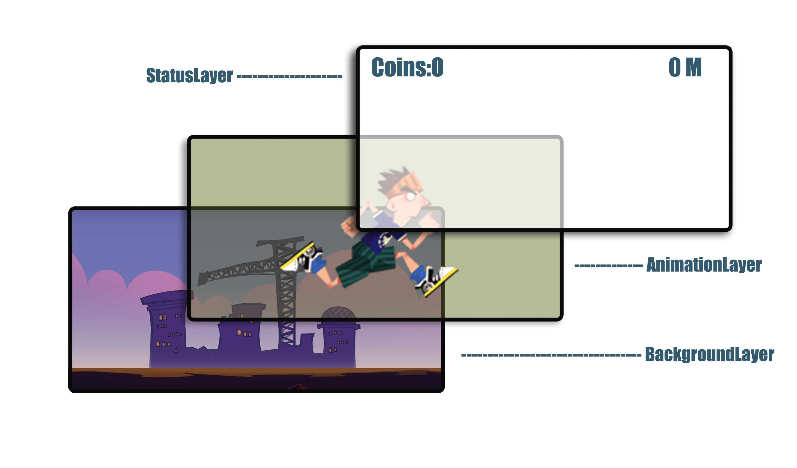

#Make Your First Game Scene
Before adding the first scene to game, you should be familiar with some basic concepts of Cocos2d. If you are already familiar with these concepts, you can safely skip this chapter and go to the next chapter.


## Basic concepts of Cocos2d
In Cocos2d world, everything is a node, the world is constructed mostly from three kinds of nodes:

- A scene node

- Some layer nodes

- Lots of sprite nodes

    Only one scene can be runned at a time, which contains at least one layer, which contains sprite nodes. In the following sections, we will dig these concepts for more details.

### Director,Scene, Layer and sprite
#### Director

The director(implemented with the cc.Director object in cocos2d-html5) is a shared (singleton) object that takes care of navigating between scenes. It knows which scene is currently active and allows you to change scenes by replacing the current scene or pushing a new one onto the scene stack. When you push a new scene onto the stack, the Director pauses the previous scene but keeps it in memory. Later, when you pop the top scene from the stack, the paused scene resumes from its last state.

The Director is also responsible for initializing OpenGL ES and set the pixel format of your OpenGL ES context. And the game loop and rendering logic also go here. It's role is actually the director of a film.

#### Scene

A scene (implemented with the cc.Scene object in cocos2d-html5) is more or less an independent piece of the app workflow. Some people may call them “screens” or “stages”. Your app can have many scenes, but only one of them is active at a given time.

For example, you could have a game with the following scenes: Intro, Menu, Level 1, Cutscene 1, Level 2, Winning cutscene, losing cutscene, High scores screen. You can think of each one of these scenes as a separate application that can be connected to other scenes with a small amount of "glue" code. For example, the intro scene might go to the menu scene when it finishes, and the scene for Level 1 might lead to cutscene 1 (if the player wins) or to the losing cutscene (if the player loses). An example of how scenes might flow in a game follows:


A Cocos2d scene is composed of one or more node, added as children to the scene. Subclasses of cc.Node, such as cc.Layer and cc.Sprite, give the scene its appearance and behavior. Typically, you implement your screens as subclasses of cc.Layer and add them to a blank instance of cc.Scene. Then, implement your other graphics and game objects as cc.Node and add them as children to the cc.Layer you created.

Because scenes are a subclass of cc.Node, they can be transformed manually or by using cc.Action. See Actions for more information.

There is also a family of cc.Scene classes called transitions, implemented with the ccTransitionScene class. These allow you to create special transition effects when switching from one scene to another--for example, fading, sliding in from the side, and so on.


#### Layer

A cc.Layer is a cc.Node that knows how to handle touch events. Layers know how to draw themselves and may be semi-transparent, allowing players to see other layers behind them. cc.Layer are very useful in defining your game's appearance and behaviour, so you should expect to spend a lot of your programming time coding cc.Layer subclasses to do what you need.



The cc.Layer is where you define touch event handlers. By implementing a method to handle one of touch events (ccTouchBegan, ccTouchMoved, ccTouchEnded, or ccTouchCancelled) a cc.Layer can react to the player's interaction. These touch events are propagated to all the layers within a scene, from front to back, until some layer catches the event and accepts it.

While complex applications will require you to define custom cc.Layer subclasses, Cocos2d provides several predefined layers. Some examples include cc.Menu (a simple menu layer), cc.ColorLayer (a layer that draws a solid color), and cc.LayerMultiplex (a layer that lets you multiplex its children, activating one at a time while disabling the others).

Layers may contain any cc.Node as a child, including cc.Sprite, cc.Label, and even other cc.Layer objects. Because layers are a subclass of cc.Node, they can be transformed manually or by using cc.Action. 


#### Sprite

A Cocos2d cc.Sprite is similar to sprites you find in other game engines. It is a 2D image that can be moved, rotated, scaled, animated, and undergo other transformations. Sprites (implemented using the cc.Sprite class) can have other sprites as children. When a parent is transformed, all its children are transformed as well. Because sprites are a subclass of cc.Node, they can be transformed manually or by using cc.Action. 


#### All these objects are Nodes

There is a root class named cc.Node in cocos2d-html5 scene graph hierarchy. The node is a subclass of cc.Class while in cocos2d-x it's a subclass of CCObject. Node class define the basic properties and some common interface of a cocos2d element. A cc.Node is a "void" object. It doesn't have a texture. If you want to display a image on screen, you should create a cc.Sprite class and assign a texture to it.

### Coordination system

Cocos2d-html5 uses the same coordinate system as OpenGL, which is so call “Right-handed Cartesian Coordinate System”. It is popular in game industry, however, it is  different from traditional top left coordinate system which used in web-page design. 


For a 2D game:

- X axis starts at the left side of the screen and increases to the right

- Y axis starts at the bottom of the screen and increases upwards

- The origin (x = 0, y = 0) is the bottom-left corner of screen. It is the first quadrant of right-handed cartesian coordinate system.

   The anchor point is used for both positioning and rotation of an object. The anchor point coordinate is relative coordinate, for example, the anchor point in position (0, 0) which we always define in short in Cocos2d as cc.p(0 , 0) corresponds to the most bottom-left of that object, while cc.p(0.5, 0.5) corresponds to the center of the object. When setting the position of an object, the object is positioned such that the anchor point will be at the coordinates specified with the setPosition() call. Similarly, when rotating the object, it is rotated around the anchor point.
   
For example, this sprite has an anchorPoint of cc.p(0, 0) and a position of cc.p(0,0).

```
 // create sprite 
    var sprite = cc. Sprite.create ( "bottomleft.png" ) ; 
    sprite. setAnchorPoint ( cc.p ( 0 , 0 ) ) ; // Anchor Point 
    sprite. setPosition ( cc.p ( 0 , 0 ) ) ; 
    this.addChild ( sprite ) ;
```


### Action

Actions are like orders given to any cc.Node object. These actions usually modify some of the object's attributes like position, rotation, scale, etc. If these attributes are modified during a period of time, they are cc.IntervalAction actions, otherwise they are cc.InstantAction actions.

For example, the cc.MoveBy action modifies the position property during a period of time, hence, it is a subclass of cc.IntervalAction.

Here is an example of running the cc.MoveBy action on a sprite:

```
// Move a sprite 50 pixels to the right, and 10 pixels to the top over 2 seconds.
sprite.runAction(cc.MoveBy.create(2, cc.p(50, 10)));
```


### Animation

In Cocos2d, animations are bind to cc.Animate actions. You can use a sequence of images to create an animation. After the animation is constructed, you can use the following code to play animation on a sprite.

```
 var animation = cc.Animation.create ( ) ; 
        for ( var i = 1 ; i < 15 ; i ++ ) {         
        var frameName = "res/Images/grossini_dance_" + ( ( i < 10 ) ? ( "0" + i ) : i ) + ".png" ; 
           animation. addSpriteFrameWithFile ( frameName ) ; 
        } 
        animation. setDelayPerUnit ( 2.8 / 14 ) ; 
        animation. setRestoreOriginalFrame ( true ) ; 
        var action = cc. Animate . create ( animation ) ; 
        sprite. runAction ( cc. Sequence . create ( action , action. reverse ( ) ) ) ;
```


### Scheduler

Scheduler is responsible for triggering the scheduled callbacks.

There are two different types of callbacks (selectors) in Cocos2d:

- Update selector: the 'update' selector will be called every frame. You can customize the priority.

- Custom selector: A custom selector will be called every frame, or with a custom interval of time.

Custom selectors should be avoided when possible because update selectors are faster and consume less memory.


### TouchEvent

Cocos2d supports two different ways of handling touch events. These are defined by two different types of delegates (both defined in CCTouchDelegateProtocol.js).
There are TargetedTouchDelegate and StandardTouchDelegate. 

Using TargetedTouchDelegate results in two benefits:

1. You don't need to deal with cc.Sets, the dispatcher does the job of splitting
   touch event set. You get exactly one cc.Touch per call.

2. You can claim a cc.Touch by returning true in onTouchBegan. Updates of the claimed
    touch is sent only to the delegate(s) that claimed them. So if you get a move/
     ended/cancelled update you're sure that's your touch. This frees you from doing a
   lot of checks when handling multi-touch.

Using StandardTouchDelegate results in two benefits:

 1. You can deal with cc.Sets by hand and you can do the job of splitting
   touch events. Thus it is very convenient to handle multiple touch.
   
 2. You don’t need to claim true or false in ccTouchesBegan. And all of your touch callbacks will be called when you touch the screen.

## Make your first Game scene
In the last tutorial, we have analysed the execution path of a cocos2d-html5 game. We know that in main.js, we load our first game scene in **applicationDidFinishLaunching**, here is the code snippet which does the real trick:

```
 //load resources
        cc.LoaderScene.preload(g_resources, function () {
            director.replaceScene(new this.startScene());
        }, this);
```

Here, we use cc.LoaderScene to preload the resources of our game and after loading all the resources, the director will run our first scene. You should pay attention to the argument of **replaceScene**. We call new operator on **this.startScene**. It is a member of the class **cocos2dApp**. 

**Note:**

The **cocos2dApp** is actually a function which mimic the behaviour of class in an object-oriented language.

```
var cocos2dApp = cc.Application.extend({
    config:document['ccConfig'],
    ctor:function (scene) {
        this._super();
        this.startScene = scene;
        cc.COCOS2D_DEBUG = this.config['COCOS2D_DEBUG'];
        cc.initDebugSetting();
        cc.setup(this.config['tag']);
        cc.AppController.shareAppController().didFinishLaunchingWithOptions();
    },
```

Here the **ctor** function is mimic a constructor in other languages like c++,java or c#. 

Here are two paragraphs which are grabbed from [here](http://www.gamefromscratch.com/post/2012/06/06/Cocos2D-HTML5-tutorial-2-Why-its-Hello-World-of-course.aspx). I highly recommend you to read the full article.

The first one:

> We are creating a new object by extending cc.Application.  If you are familiar with C++, Java or C# you may be looking at this code and thinking it is both vaguely familiar and different at the same time.  There is a good reason for that.  JavaScript isn’t really “object oriented” in the way you are familiar with, it is [prototype based](http://en.wikipedia.org/wiki/Prototype-based).  This is beyond the scope of what I can explain here, but basically there are no classes.  Instead there are “prototypes” that you clone and extend.  So essentially you define something once, which is then used as a prototype for creating “objects” in the future. 

The second one:

> Essentially what we are doing here is defining our **cocos2dApp** object to extend the cc.Application prototype.  This is a pretty common behavior in working with Cocos2D, so hopefully you can wrap your head around it.  We then implement the ctor ( constructor ) and applicationDidFinishingLaunching.  Again, if you are used to C++ like languages, you can think of cocos2dApp as being derived from cc.Application, then overriding the default constructor and a virtual method.  If you aren’t a C++/C# or Java programmer, forget everything I just said. 

#### Do some cleanup work

Ok, I think the background information is enough. Let's do some cleanup stuff.

##### Delete the multiple resolution stuff

1. Delete **HD** and **Normal** folder under **res** directory. Leave your res directory looks like this:(this resource files can be found from our sample project)

	

2. Delete the following code pieces in main.js:

```
        var platform = cc.Application.getInstance().getTargetPlatform();
        if (platform == cc.TARGET_PLATFORM.MOBILE_BROWSER) {
            resDirOrders.push("HD");
        }
        else if (platform == cc.TARGET_PLATFORM.PC_BROWSER) {
            if (screenSize.height >= 800) {
                resDirOrders.push("HD");
            }
            else {
                resourceSize = cc.size(320, 480);
                designSize = cc.size(320, 480);
                resDirOrders.push("Normal");
            }
        }
       cc.FileUtils.getInstance().setSearchResolutionsOrder(resDirOrders);
       director.setContentScaleFactor(resourceSize.width / designSize.width);
```

and delete the following code:

```
   var screenSize = cc.EGLView.getInstance().getFrameSize();
   var resourceSize = cc.size(480, 800);
   var resDirOrders = [];
```


##### Cleanup the myApp.js

This process is very simple. At first, we should delete all the contents of myApp.js. Because we will rewrite them from scratch.

Secondly, we should change this line in main.js:

```
var myApp = new cocos2dApp(MyScene);
```

to 

```
var myApp = new cocos2dApp(MenuScene);
```
Yeah, I guess you have got the point. We will define our first class which name is MenuScene.

At last, we should define some resource variables for easy access.

Open resource.js and change it's content to this:

```
  var s_HelloBG = "helloBG.png";
  var s_start_n = "start_n.png";
  var s_start_s = "start_s.png";

  var g_resources = [
    //image
    {src:s_HelloBG},
    {src:s_start_n},
    {src:s_start_s}
  ];
```

#### Define your first scene - MenuScene

Open myApp.js and start to define the MenuLayer:

```
var MenuLayer = cc.Layer.extend({
    ctor : function(){
    	//1. call super class's ctor function
        this._super();
    },
    init:function(){
    	//call super class's super function
    	this._super();
    	
    	//2. get the singleton director
        var director = cc.Director.getInstance();
        
        //3. get the screen size of your game canvas
        var winsize = director.getWinSize();
        //4. calculate the center point
        var centerpos = cc.p(winsize.width / 2, winsize.height / 2);

		//5. create a background image and set it's position at the center of the screen
        var spritebg = cc.Sprite.create(s_HelloBG);
        spritebg.setPosition(centerpos);
        this.addChild(spritebg);

		//6.
        cc.MenuItemFont.setFontSize(60);
        
        //7.create a menu and assign onPlay event callback to it
        var menuItemPlay= cc.MenuItemSprite.create(
            cc.Sprite.create(s_start_n), // normal state image
            cc.Sprite.create(s_start_s), //select state image
            this.onPlay, this);
        var menu = cc.Menu.create(menuItemPlay);  //7. create the menu
        menu.setPosition(centerpos);
        this.addChild(menu);
    },

    onPlay : function(){
        cc.log("==onplay clicked");
    }
});
```

Let's go through all the details from 1-7:

1. It calls the init function of it's super class.
2. Since Director is designed as a singleton class,so we can use getInstance() to obtain the instance.
3. Get the screen size of you game
4. Calculate the center point of your screen which will be used to center background images.
5. Create a background image with filename and set it's position to the center of the screen. At last, add the sprite to MenuLayer as a child.
6. Call MenuItemFont's setFontSize function to adjust the font size. It is not used in this example. But if you what to use MenuItemFont to create some menu items, it will affect the menu item label size.
7. create a menu with two images, one for normal state and another for selected state. Then we set the menu's position to the center of your screen. At last, it is added to the current layer.

**Note:**

> Don't copy these code or try to remember all of these dirty things. Because cocos2d-html5 is under active development. The API will be minor changed due to some reasons. So try to understand it.
 
And also we should define a Menu scene:

```
var MenuScene = cc.Scene.extend({
    onEnter:function () {
        this._super();
        var layer = new MenuLayer();
        layer.init();
        this.addChild(layer);
    }
});
```
The process of creating a MenuScene is very straightforward. You define a variable which derived from cc.Scene. You should remember the sign **extend** is used for extending class.

Once the scene is created, a **onEnter** function should be defined. It has the MenuLayer as it's child. We can also define a **ctor** function instead of the onEnter function. The onEnter function is called after ctor function.


## Summary

In this tutorial,  I have shown you the basic concepts you need to know when you first start programming cocos2d games. And also giving you a detailed explanation of how to set up your first game scene. Hope you enjoy it and happy coding! The related sample project can be downloaded at [here](https://github.com/iTyran/cocos2dhtml5Doc/blob/master/2.0make-your-first-game-scene/Parkour.zip).

## Where to go from here

In the next chapter, I will show you how to define your game scene and along with the various game layers. How to design these layers, what's the responsibility of these layers. 


