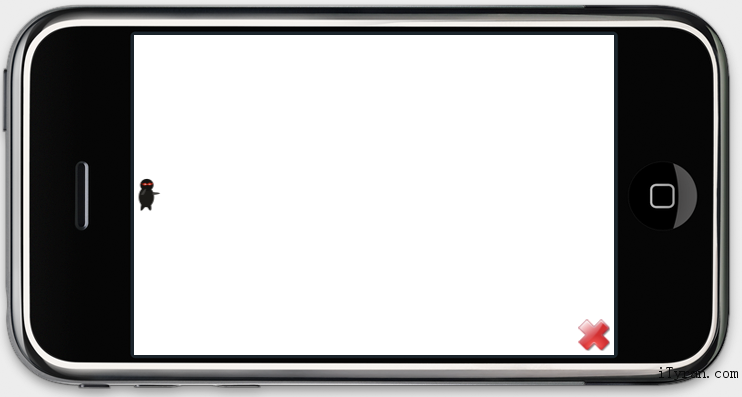

**提示：建议按照教程来一步步完成你的游戏，也可以下载完整工程直接编译运行。教程源代码**

## 1. 添加图片资源 ##
 这里是你的Cocos2dSimpleGame工程所用到的3张图片资源，由Ray Wenderlich ’s wife 制作。

  

如果你完成[Chapter 1 – Create a New cocos2d-x project with multi-platforms](http://www.cocos2d-x.org/wiki/Chapter_1_-_How_to_Create_a_New_cocos2d-x_project_on_multi-platforms)，你肯定有一个cocos2d-x/Cocos2dSimpleGame文件夹。请下载上面那些图片并且拷贝到cocos2d-x/Cocos2dSimpleGame/Resources 文件夹中。然后返回到不同平台的开发环境中。

### 1.1 iPhone环境添加资源###
很简单 ，打开Xcode，右键Cocos2dSimpleGame/Resources，点击‘Add -> Existing Files’，添加上面的3张图片。注意确保“Add to Targets”窗口中的“Cocos2dxSimpleGame复选框”为选中状态。

### 1.2 android环境添加资源 ###
如果你运行build_native.sh来编译，你需要将这些图片拷贝到Resources文件夹，另外你应该将图片文件复制到“assets”文件夹。

###1.3 win32环境添加资源###
Win32可执行文件会从它关联的路径中找寻这些资源。所以我们需要亲手把图片从cocos2d-x/Cocos2dSimpleGame/Resources复制到cocos2d-x/Debug.win32文件夹中。（不过像我这样的懒人，总是会找到懒方法） 

Event -> Command Line中写上这句话：
xcopy /Y /E .\Resources\*.* $(OutDir)每次编译完成，VistualStudio会复制这些资源到可执行路径中。
## 2. 添加精灵 ##

你会看到从Objective-C转到C++有多简单。打开HelloWorldScene.cpp文件，用下面的代码替代init方法。
  
	bool HelloWorld::init(){	 bool bRet = false;	do
		{
			//////////////////////////////////////////////////////////////////////////
			// super init first
			//////////////////////////////////////////////////////////////////////////		CC_BREAK_IF(! CCLayer::init());
			//////////////////////////////////////////////////////////////////////////
			// add your codes below...
			//////////////////////////////////////////////////////////////////////////
			// 1. Add a menu item with "X" image, which is clicked to quit the program.
			// Create a "close" menu item with close icon, it's an auto release object.
			CCMenuItemImage *pCloseItem = CCMenuItemImage::create(
			"CloseNormal.png",
			"CloseSelected.png",
			this,
			menu_selector(HelloWorld::menuCloseCallback));
			CC_BREAK_IF(! pCloseItem);
			// Place the menu item bottom-right conner.
			pCloseItem->setPosition(ccp(CCDirector::sharedDirector()->getWinSize().width - 20, 20));
			// Create a menu with the "close" menu item, it's an auto release object.
			CCMenu* pMenu = CCMenu::create(pCloseItem, NULL);
			pMenu->setPosition(CCPointZero);
			CC_BREAK_IF(! pMenu);	 
			// Add the menu to HelloWorld layer as a child layer.
			this->addChild(pMenu, 1);
			/////////////////////////////
			// 2. add your codes below...
			CCSize winSize = CCDirector::sharedDirector()->getWinSize();
			CCSprite *player = CCSprite::create("Player.png",
			CCRectMake(0, 0, 27, 40) );
			player->setPosition( ccp(player->getContentSize().width/2, winSize.height/2) );
			this->addChild(player);
			bRet = true;
		} while (0);
		return bRet;
	}

我们实际上只添加了注释“2. Add your codes below…”这部分代码。你可以一行一行查看 cocos2d-iPhone是怎样转变到cocos2d-x 多平台代码的。 

	// cpp with cocos2d-x
	bool HelloWorld::init()
	{
		if ( CCLayer::init() )
		{
			CCSize winSize = CCDirector::sharedDirector()->getWinSize();
			CCSprite *player = CCSprite::create("Player.png",
			CCRectMake(0, 0, 27, 40) );
			player->setPosition( ccp(player->getContentSize().width/2,
			winSize.height/2) );
			this->addChild(player);	}
		return true;
	}
.

	// objc with cocos2d-iphone
	-(id) init
	{
		if( (self=[super init] ))
		{
			CGSize winSize = [[CCDirector sharedDirector] winSize];
			CCSprite *player = [CCSprite spriteWithFile:@"Player.png"
			rect:CGRectMake(0, 0, 27, 40) ];
			player.position = ccp(player.contentSize.width/2,
			winSize.height/2);
			[self addChild:player];
		}
		return self;
	}

### 提示1 ###
不要在C++中像OC一样使用 __super（有两个’_’下划线）。__super关键字只被VC++所识别，不能被GCC编译。所以你最好命名父类为 CCLayer::init()。

 这里没有OC中的属性的概念。需要使用get/set方法代替。例如：如果想要获取到CCSprite的contentSize属性，你必须调用sprite->getContentSize()这个方法。方法的命名规则：对contentSize首字母大写，然后添加“get”前缀。

 使用setter方法来给属性赋值。像“player.position = …”转为“player->setPosition(…)”。

 但是数据结构的使用不遵循上面的规则。比如：在winSize结构中没有getter/setter方法来封装“width”和“height”。

 我们曾经频繁地使用像CGRectMake、CGPointMake、CGSizeMake、CGPointZero、CGRectZero CGGeometry这样的函数。你可以在cocos2dx/include/CGGeometry.h中找到他们。他们的使用方法跟iOS一样，但是为了命名冲突，在cocos2d-x中，以CG、NS、UI为前缀的类，都被换成了CC前缀。

 所有cocos2d-x中的元素，像sprite、layer、scene、label、action，都能在堆中被分配。所以我们必须使用“->”来调用他们的方法。

 在ccp中使用“this”关键字来代替OC中的“self”关键字。

init方法中的return类型变成了“bool”值。ccp中没有“id”关键字，所以方法中返回“id”将会转换为对象指针或者bool值。

android上，标题栏会占用一些空间，所以在设置player的坐标时应该设置为ccp(player.contentSize.width/2+40,winSize.height/2)。很好！我们可以编译运行代码了。现在这个忍者穿着黑衣，一双红色的眼睛隐藏在黑色的背景中。为了游戏，我们把背景色改成白色。很简单，将HelloWorld的继承类CCLayer修改为CCLayerColor。首先，修改HelloWorldScene.h的声明 

	// cpp with cocos2d-x
	class HelloWorld : public cocos2d::CCLayerColor
	// objc with cocos2d-iphone
	@interface HelloWorld : CCLayerColor

然后将起初的HelloWorld::init()中的代码 

	if ( !CCLayer::init() ){
		return false;
	}

修改为 

	if ( !CCLayerColor::initWithColor( ccc4(255,255,255,255) ) ){
		return false;
	}

上面有一点点跟RayWenderlich的代码不同，因为咱喜欢有保护的程序设计。正常代码是如果supper 初始化成功，然后做你想做的事…，我更喜欢如果初始化失败，先处理错误，在继续往下写代码。回到主题，让我们再次比较下objc转成cpp代码：

	// cpp with cocos2d-x
	if ( CCLayerColor::initWithColor( ccc4(255,255,255,255) ) )
.

	// objc with cocos2d-iphone
	if ( self = [super initWithColor:ccc4(255,255,255,255)] )

### 提示2 ###
1.  C++中默认情况下的继承是私有的，所以CCLayerColor前面的修饰符“public”是必须的。
2.  Cocos2d-iPhone主要的作者RicardoQuesada建议我们在cocos2d-x中使用命名空间。检查你的cocos2d-x类调用是在“cocos2d”命名空间还是“Cocosenshion”命名空间中很重要。

开始编译运行。你可以看见一个英雄孤独地站在白色背景上。 

·  iPhone截图

·  Android截图

·Win32截图

  