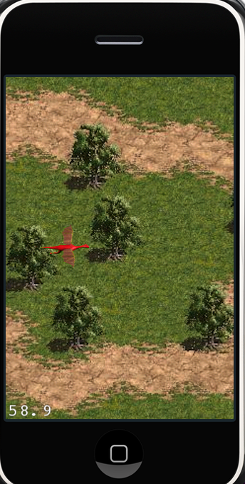
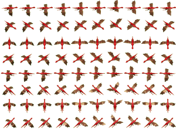

# Cocos2d-x 精灵教程：第一部分

## 前言

朋友们，欢迎回来！今天，我们将要征服cocos2d里面的精灵。这个过程并不会像你想像中那么难，接下来的教程，我就会证明给你看。首先，我们有N种方法在屏幕上显示一张图片。。。其实，我们在《coco2d-x 菜单教程：第三部分》就已经知道一种显示图片的方式了。

那么，我们今天将学习哪些内容呢？我们将学习有关 “Sprite”, “SpriteSheets”, “SpriteFrame”，以及“Texture2d” 和 “TextureCache”的一切！在这篇教程的最后，我们将有一条龙在一个简单的背景地形上面飞，路径由用户的手指滑动touch决定。很酷吧？

这里有本教程的[完整源代码](./sprite-tutorial-part1.zip)

在这个教程中，我们还是学习一些基础知识--不过没有菜单啦，我们主要关心的是精灵（sprite）。先看一看整个教程最后的产品是什么样子吧！如下图所示：



是否有点激动了呢？我敢打赌你现在很激动。。。不管怎么说，直接切入主题吧。。。

首先，我们使用上个教程的 SceneManager.h/.cpp ，这里我们只创建“PlayLayer”类。

我们首先要做的就是把“dragon.png”图片拖到Resources文件夹下去，它是一张750×560的图片，我把它缩小显示在下图。你可以从这里下载完整大小的图片资源。

那里面还有一张地形背景图，它的大小为480×320，我也把它缩小显示出来了：



像之前的菜单教程一样，把这里图片添加进resources分组下面去--你按住ctrl-click在“Resources”文件夹里面挑选你想要添加进工程的图片，记住，如果图片不是放在Reources文件夹下，那么最好选中 “copy to directory”复选框。

好了，一旦你添加进去以后，它看起来的结构如下图所示：


我们的工程将包含两个类（delegate类除外）： SceneManager 和 PlayLayer。我们已经知道SceneManger是如何工作的了，这里就不再啰嗦了。（可以参考《cocos2d菜单教程：第一部分》），但是，下面是我移除掉一些菜单选项后的SceneManager类。

SceneManager.h

```
#pragma once
#include "cocos2d.h"
#include "PlayLayer.h"

USING_NS_CC;

class SceneManager: public Object 
{
public:
	static void goPlay();
	static void go(Layer* layer);
	static Scene* wrap(Layer* layer);
};
```

SceneManager.cpp

```
#include "SceneManager.h"

void SceneManager::goPlay()
{
	auto layer = PlayLayer::create();
	SceneManager::go(layer);
}

void SceneManager::go(Layer* layer)
{
	auto director = Director::getInstance();
	auto newScene = SceneManager::wrap(layer);
	
	if (director->getRunningScene())
	{
		director->replaceScene(newScene);
	}
	else
	{
		director->runWithScene(newScene);
	}
}

Scene* SceneManager::wrap(Layer* layer)
{
	auto newScene = Scene::create();
	newScene->addChild(layer);
	return newScene;
}
```

一定要记得，把delegate类里面的Director replaceScene调用，改成 “[SceneManager goPlay];”调用。

好，如果你们都看了菜单教程的话，那么看到这里，你们可能会觉得烦了。所以，来点新鲜的吧：

PlayLayer.h

```
#pragma once
#include "cocos2d.h"
#include "SceneManager.h"

USING_NS_CC;

class PlayLayer: public Layer
{
public:
	Vector<Action*>* flyActionArray;
	Sprite* dargon;
	Action* flyAction;
	Action* moveAction;
	bool moving;
	
	CREATE_FUNC(PlayLayer);
	bool virtual init();
};
```

那么，这里做了些什么事呢？我们创建了三个实例变量：_dragon, _flyAction and _moveAction.从名字差不多也可以看出来它们到底是干什么用的，_dragon是我们的主角精灵，_flyAnimmation负责处理dragon的煽动翅膀的动画，而_moveAction负责处理从一点移动到另一个点。

因此，Sprite非常重要，但是，你可能会问你自己，我到底是应该继承CCSprite，还是包含一个Sprite实例呢？我这里不使用一个Dragon类来继承Sprite的原因是你可以从文件中加载一张图片来初始化它。这里有一个非常著名的问题：“Is-a”还是“has-a”？好吧，我的喜好是派生至Node，然后把所有的Sprite当作它的属性。因为，我相信这样做会给你最大的灵性性。我承认，如果从Sprite继承的话，刚开始会有许多方便之处，比如可以直接添加到BatchNode等。但是，我还是坚信，把CCSprite当作一个属性的话，你可以在以后的编程中获得巨大的好处。

PlayLayer.cpp

```
#include "PlayLayer.h"

enum {ktagSpriteSheet = 1,};

bool PlayLayer::init()
{
	if (!Layer::init())
	{
		return false;
	}
	
	auto background = Sprite::create("Terrain.png");
	background->setPosition(ccp(160,240));
	this->addChild(background);
	
	auto texture = TextureCache::getInstance()->addImage("dragon.png");
	auto sheet = SpriteBatchNode::create("dragon.png",10);
	this->addChild(sheet, 0, ktagSpriteSheet);
	Size s = Director::getInstance()->getWinSize();
	
	Vector<SpriteFrame*> animFrames;
	for (int i = 0; i < 8; i++)
	{
		animFrames.clear();
		for (int j = 0; j < 10; j++)
		{
			auto frame = SpriteFrame::createWithTexture(texture, Rect(j * 75, i * 70, 75, 70), false, Director::getInstance()->getVisibleOrigin(), Size(75, 70));
			animFrames.pushBack(frame);
		}
		
		auto animation = Animation::createWithSpriteFrames(animFrames, 0.1f);
		auto animate = Animate::create(animation);
		auto seq = Sequence::create(animate, NULL);
		
		this->flyAction = RepeatForever::create(seq);
		flyActionArray->pushBack(this->flyAction);
	}
		
	auto frame1 = SpriteFrame::createWithTexture(texture, Rect(0, 0, 75, 70), false, Director::getInstance()->getVisibleOrigin(), Size(75, 70));
	
	this->dargon = Sprite::createWithSpriteFrame(frame1);
	dargon->setPosition(ccp(s.width/2-80,s.height/2));
	
	sheet->addChild(dargon);
	
	this->flyAction = flyActionArray->at(0);
	dargon->runAction(flyAction);
	
	return true;
}
```

ok，上面的代码看起来比较长，不过没关系，让我们分别解释下：

　　首先是加载背景图片

```
auto background = Sprite::create("Terrain.png");
background->setPosition(ccp(160,240));
this->addChild(background);
```

背景图片加载后放置在屏幕的中心（默认情况下，图片的anchorPoint是图片的中心，你可以使用anchorPoint属性来改变它--举个例子：把背景的anchorPoint从中心点

```
background->setAnchorPoint(cpp(0.5,0.5));
```

改成图片的左下角：

```
background->setAnchorPoint(cpp(0.0,0.0));
```

接下来：

```
auto texture = TextureCache::getInstance()->addImage("dragon.png");
auto sheet = SpriteBatchNode::create("dragon.png",10);
this->addChild(sheet, 0, ktagSpriteSheet);
```

TextureCache和Texture2D是n种方式中的一种，可以把一张图片加载到Sprite中去。我是认真的，真的有n种方法可以做这个事情。。。现在，我不想让你头晕，所以先不列举其它方法了。。。让我们先看看这段代码都做了些什么吧。首先，加载一张dragon.png图片到texture对象中。

因此，接下来，好多人都对SpriteBatchNode的使用感到迷惑不解。一个SpriteBatchNode是一种效率比较高的渲染精灵的方式。比如，你把Sprite加到CCLayer中，那么sprite的draw函数在每一帧调用时都会执行7个opengl 调用来完成sprite的渲染。一个精灵的时候当然没问题，但是，当你在屏幕上有200个精灵的时候，那么就会有200×7次opengl调用。。。而SpriteBatchNode可以“批处理”它的孩子精灵的draw调用。这意味着，当把200个精灵加到SpriteBatchNode中去的时候，只要使用7个opengl调用就可以完成200个孩子的渲染了。在本例中，我们看到dragon类也有许多精灵，所以我们要使用SpriteBatchNode。

更新：关于CCSpriteBatchNode的误解，请参看泰然论坛这个[帖子](http://bbs.ityran.com/forum.php?mod=viewthread&tid=1030&page=1#pid6441)。　

1.通过使用纹理集（texture atlas），你可以加快游戏的加载时间，同时减少耗费的内存资源。

2.通过使用SpriteSheet（SpriteBatchNode），你可以提供渲染的性能，（具体查看Performance Tests）

3.通过使用TextureCache和SpriteSheet，那么你可以同时获得加载时间的性能和渲染的性能提升。

当然，现在只有一只龙，可能看不出明显的效果提升。但是，这是最佳实践，你最好一开始就按照这种方式去做，它会为你以后省去很多麻烦事。

```
Vector<SpriteFrame*> animFrames;
for (int i = 0; i < 8; i++)
{
	animFrames.clear();
	
	for (int j = 0; j < 10; j++)
	{
		auto frame = SpriteFrame::createWithTexture(texture, Rect(j * 75, i * 70, 75, 70), false, Director::getInstance()->getVisibleOrigin(), Size(75, 70));
		animFrames.pushBack(frame);
	}
	
	auto animation = Animation::createWithSpriteFrames(animFrames, 0.1f);
	auto animate = Animate::create(animation);
	auto seq = Sequence::create(animate, NULL);
	
	this->flyAction = RepeatForever::create(seq);
	flyActionArray->pushBack(this->flyAction);
}
```

上面这个部分似乎做了很多事情--但是，实际上很简单。我们使用SpriteFrame来创建精灵动画帧，一个SpriteFrame就是从texture里面抠出来的一块小图片区域，需要指定矩形区域。它并不包含图片本身，而是更像一帧图像。每一次，动画运行的时候，就会运行一系列的SpriteFrames，而每个SpriteFrames指向texture里的一小块图片。

因为我们的dragon每个动画都有10张图片，总共有8个方向飞行的动画（对应东南西北8个方向的动画）。我们创建了80个帧，然后把每一个方向飞行的动画都存到Vector(SpriteFrame*)里面。然后，我们把所有的flyAction再添加到flyActionArray里面去。

```
auto frame1 = SpriteFrame::createWithTexture(texture, Rect(0, 0, 75, 70), false, Director::getInstance()->getVisibleOrigin(), Size(75, 70));

this->dargon = Sprite::createWithSpriteFrame(frame1);
dargon->setPosition(ccp(s.width/2-80,s.height/2));

sheet->addChild(dargon);

this->flyAction = flyActionArray->at(0);
dargon->runAction(flyAction);
```

因为dragon刚开始时需要有一张图片作为初始状态，所以，我们从animation里面取出第一帧（位置在0，0，宽度是75，高度是70）。我们把dragon精灵初始位置设在屏幕中间偏左一点，然后把它加到spritesheet中，目的是为了获得更好的性能提升。

　　然后，我们开始运行第一个动画。。。现在，我们可以飞啦！

　　下篇教程见！

-----------------------------------------

后记：这里使用的方法，说实话，真的过时了。：）不过我们了解了也是有好处的。之前翻译的ray的教程里面，都是使用texturePacker生成pvr.ccz和plist文件来处理的。获得动画帧也很简单，直接spriteFrameByName就可以了。

原文链接地址：[http://www.iphonegametutorials.com/2010/09/10/cocos2d-sprite-tutorial/](http://www.iphonegametutorials.com/2010/09/10/cocos2d-sprite-tutorial/)