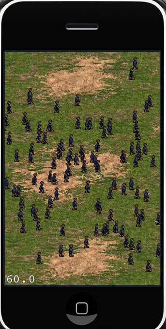

# Cocos2d-x 精灵教程：第三部分

## 前言

我们在第2部分教程中已经介绍了如何让dragon沿着8个不同的方向移动，并且播放相应的动画，同时，移动过程可以由用户touch屏幕来控制。cocos2d-x 很酷吧！好了，今天我们将多干点活，我们将创建一大批村民--实际上是N个村民。我们会使用我们已经学习过的技术，从spritesheet里面加载精灵，同时建立相应的精灵动画。

这里有本教程的[完整源代码](./sprite-tutorial-part3.zip)。

那么，我们到底要做成什么样子呢---看了下面的图就明白了：



上面加载了好多村民，但是，屏幕的帧速率仍然是60 fps。这是因为我们做了优化。那么，究竟是如何做的呢？让我们马上开始学习吧。

首先，我们要创建我们的adventurer （冒险者）类。---它里面存储了我们的移动和行走动画的精灵实例。在屏幕上每一个冒险家，我们都会为之创建一个adventurer 类的实例。

Adventurer.h

```
#include "cocos2d.h"

USING_NS_CC;

class Adventurer: public Node {
	Sprite* charSprite;
	Action* walkAction;
	Action* moveAction;
	bool moving;
};
```

如果你愿意的话，你也可以从Sprite继承，然后我们可以调用initWithFile方法来初始化我们的Adventure 类。但是，我更喜欢从Node继承，然后包含一个Sprite的实例。

Adventurer.cpp

```
#include "Adventurer.h"

bool Adventurer::init()
{
	if (!Node::init())
	{
		return false;
	}
	
	return true;
}
```

很简单的init函数,上面这段代码，我们再熟悉不过了。这里创建了一个非常简单的类，但是，也给我们一些提示，如何为游戏主角创建class。

现在，我们拥有角色了，让我们来使用之。。。先回到“PlayLayer.h” ，然后做下面一些变更：

```
#pragma once
#include "cocos2d.h"
#include "SceneManager.h"

USING_NS_CC;

class PlayLayer: public Layer
{
public:
	Vector<Action*> flyActionArray;
	Texture2D* texture;
	SpriteBatchNode* spritesheet;
	Vector<char*> charArray;
	Sprite* dragon;
	Action* flyAction;
	Action* moveAction;
	bool moving;

	CREATE_FUNC(PlayLayer);
	
	bool virtual init();
	void virtual onEnter();
	bool onTouchBegan(Touch *touch, Event *event);
	void onTouchMoved(Touch *touch, Event *event);
	void onTouchEnded(Touch* touch, Event* event);
};
```

我们先导入 “Adventurer.h”，然后定义了3个实例变量。第一个变量 “texture”用来加载adventurer 精灵表单。第二变量 “spritesheet”是把我们将要创建的精灵都进行“批处理”，使之提高效率。最后，我们想要追踪所有的adventurers，所以，我们定义了一个“charArray”.数组。同时我们为每一个实例变量都声明了属性，这样我们就可以在PlayLayer.m间接使用了。（另一种方法是定义tag，在init方法里面指定tag，然后在其它方法里面就可以用self getChildByTag:tag来获得想要的孩子了）

OK，现在我们有一堆类了。不过别担心，我们会在后面把它逐步分开讲解--首先，先让我们实现

PlayLayer.cpp：

```
#include "PlayLayer.h"

enum {ktagSpriteSheet = 1,};

bool PlayLayer::init()
{
	if (!Layer::init())
	{
		return false;
	}
	
	auto background = Sprite::create("Terrain.png");
	background->setPosition(ccp(160,240));
	this->addChild(background);
	
	auto texture = TextureCache::getInstance()->addImage("dragon.png");
	auto sheet = SpriteBatchNode::create("dragon.png",10);
	this->addChild(sheet, 0, ktagSpriteSheet);
	
	Size s = Director::getInstance()->getWinSize();
	Vector<SpriteFrame*> animFrames;
	for (int i = 0; i < 8; i++)
	{
		animFrames.clear();
		for (int j = 0; j < 10; j++)
		{
			auto frame = SpriteFrame::createWithTexture(texture, Rect(j * 75, i * 70, 75, 70), false, Director::getInstance()->getVisibleOrigin(), Size(75, 70));
			animFrames.pushBack(frame);
		}
		
		auto animation = Animation::createWithSpriteFrames(animFrames, 0.1f);
		auto animate = Animate::create(animation);
		auto seq = Sequence::create(animate, NULL);
		
		this->flyAction = RepeatForever::create(seq);
		flyActionArray.pushBack(this->flyAction);
	}
	
	auto frame1 = SpriteFrame::createWithTexture(texture, Rect(0, 0, 75, 70), false, Director::getInstance()->getVisibleOrigin(), Size(75, 70));
	this->dragon = Sprite::createWithSpriteFrame(frame1);
	dragon->setPosition(ccp(s.width/2-80,s.height/2));
	
	sheet->addChild(dragon);
	this->flyAction = flyActionArray.at(0);
	dragon->runAction(flyAction);
	
	texture = TextureCache::getInstance()->addImage("adventurer.png");
	spriteSheet = SpriteBatchNode::createWithTexture(texture,100);
	this->addChild(spriteSheet,0,ktagSpriteSheet);
	this->schedule(schedule_selector(PlayLayer::gameLogic), 1.0f);
	
	return true;
}

void PlayLayer::addAdventurer()
{
	Vector<SpriteFrame*>animFrames;
	animFrames.clear();
	
	for (int i = 0; i < 9; i++) 
	{
		auto *frame = SpriteFrame::createWithTexture(this->texture, Rect(i * 16, 0, 16, 29));
		animFrames.pushBack(frame);
	}
	
	auto adventurer = Adventurer::create();
	if (adventurer != NULL) {
		auto *frame1 = SpriteFrame::createWithTexture(this->texture, Rect(0, 0, 19, 29));
		adventurer->charSprite = Sprite::createWithSpriteFrame(frame1);
		
		Size s = Director::getInstance()->getWinSize();
		int minY = adventurer->charSprite->getContentSize().width/2;
		int maxY = s.height - adventurer->charSprite->getContentSize().height / 2;
		int rangeY = maxY - minY;
		int actualY = (CCRANDOM_0_1() * rangeY) + minY;
		
		int minX = -300;
		int maxX = 0;
		int rangeX = maxX - minX;
		int actualX = (CCRANDOM_0_1() * rangeX) + minX;
		
		adventurer->charSprite->setPosition(ccp(actualX, actualY));
		auto *animation = Animation::createWithSpriteFrames(animFrames,0.2);
		auto *animate = Animate::create(animation);
		auto *seq = Sequence::create(animate,NULL);
		adventurer->walkAction = RepeatForever::create(seq);
		
		auto actionMove = MoveTo::create(10.0f,ccp(s.width + 200, actualY));
		auto actionMoveDone = CallFuncN::create(CC_CALLBACK_1(PlayLayer::spriteMoveFinished,this,(void*)adventurer));
		adventurer->moveAction = Sequence::create(actionMove,actionMoveDone,NULL);
		
		adventurer->charSprite->runAction(adventurer->walkAction);
		adventurer->charSprite->runAction(adventurer->moveAction);
		
		this->addChild(adventurer->charSprite)
		charArray.pushBack(adventurer);
	}
}

void PlayLayer::spriteMoveFinished(Node* sender, void* adv)
{
	auto adventurer = (Adventurer*)adv;
	Size s = Director::getInstance()->getWinSize();
	
	int minY = adventurer->charSprite->getContentSize().height / 2;
	int maxY = s.height - adventurer->charSprite->getContentSize().height / 2;
	int rangeY = maxY - minY;
	int actualY = (CCRANDOM_0_1() * rangeY) + minY;
	
	int minX = -300;
	int maxX = 0;
	int rangeX = maxX - minX;
	int actualX = (CCRANDOM_0_1() * rangeX) + minX;
	
	adventurer->charSprite->setPosition(ccp(actualX, actualY));
	adventurer->stopAction(adventurer->moveAction);
	adventurer->charSprite->runAction(adventurer->moveAction);
}

void PlayLayer::gameLogic(float dt)
{
	this->addAdventurer();
}

void PlayLayer::onEnter()
{
	Layer::onEnter();
	
	auto listener = EventListenerTouchOneByOne::create();
	listener->setSwallowTouches(true);
	
	listener->onTouchBegan = CC_CALLBACK_2(PlayLayer::onTouchBegan, this);
	listener->onTouchMoved = CC_CALLBACK_2(PlayLayer::onTouchMoved, this);
	listener->onTouchEnded = CC_CALLBACK_2(PlayLayer::onTouchEnded, this);
	
	auto dispatcher = Director::getInstance()->getEventDispatcher();
	dispatcher->addEventListenerWithSceneGraphPriority(listener, this);
}

void PlayLayer::onTouchEnded(Touch* touch,Event* event) 
{
	Point touchLocation = this->convertToWorldSpace(this->convertTouchToNodeSpace(touch));
	Point moveVector = touchLocation - dragon->getPosition();
	
	float distanceToMove = ccpLength(moveVector);
	float moveAngle = ccpToAngle(moveVector);
	float cocosAngle = CC_RADIANS_TO_DEGREES(-1 * moveAngle);
	
	float dragonVelocity = 480.0 / 3.0;
	float moveDuration = distanceToMove / dragonVelocity;
	
	cocosAngle += 23;
	if (cocosAngle < 0)
	{
		cocosAngle += 360;
	}
	
	int runAnim = (int)((cocosAngle)/45);
	
	dragon->stopAction(flyAction);
	this->flyAction = flyActionArray.at(runAnim);
	dragon->runAction(flyAction);
	
	this->moveAction = Sequence::create(MoveTo::create(moveDuration,touchLocation),NULL);
	dragon->runAction(moveAction);
}
```

OK，千万别头疼--接下来我会一点点分解：

```
bool PlayLayer::init()
{
	if (!Layer::init())
	{
		return false;
	}
	
	auto background = Sprite::create("Terrain.png");
	background->setPosition(ccp(160,240));
	this->addChild(background);

	auto texture = TextureCache::getInstance()->addImage("dragon.png");
	auto sheet = SpriteBatchNode::create("dragon.png",10);
	this->addChild(sheet, 0, ktagSpriteSheet);
	
	Size s = Director::getInstance()->getWinSize();
	Vector<SpriteFrame*> animFrames;
	for (int i = 0; i < 8; i++)
	{
		animFrames.clear();
		for (int j = 0; j < 10; j++)
		{
			auto frame = SpriteFrame::createWithTexture(texture, Rect(j * 75, i * 70, 75, 70), false, Director::getInstance()->getVisibleOrigin(), Size(75, 70));
			animFrames.pushBack(frame);
		}
		
		auto animation = Animation::createWithSpriteFrames(animFrames, 0.1f);
		auto animate = Animate::create(animation);
		auto seq = Sequence::create(animate, NULL);
		
		this->flyAction = RepeatForever::create(seq);
		flyActionArray.pushBack(this->flyAction);
	}
	
	auto frame1 = SpriteFrame::createWithTexture(texture, Rect(0, 0, 75, 70), false, Director::getInstance()->getVisibleOrigin(), Size(75, 70));
	
	this->dragon = Sprite::createWithSpriteFrame(frame1);
	dragon->setPosition(ccp(s.width/2-80,s.height/2));
	sheet->addChild(dragon);
	
	this->flyAction = flyActionArray.at(0);
	dragon->runAction(flyAction);
	
	texture = TextureCache::getInstance()->addImage("adventurer.png");
	spriteSheet = SpriteBatchNode::createWithTexture(texture,100);
	this->addChild(spriteSheet,0,ktagSpriteSheet);
	
	this->schedule(schedule_selector(PlayLayer::gameLogic), 1.0f);
	return true;
}
```

好，首先看到“init”函数，它和我们之前的adventurer 类一样，先调super init，如果失败的话，就直接返回nil。然后我们添加了一张背景图片叫做"Terrain.png"并把它放置在屏幕的中心（因为我们知道图片的默认中心点anchorPoint是0.5，0.5）。然后直接把它加到当前层中。

接下来，我们初始化纹理和SpriteBatchNode--首先把"adventurer.png"加载到CCTexture2D变量中，然后使用createWithTexture来建立一个精灵表单。（我们也可以用create这个函数来建立SpriteBatchNode，但是，我想向你展示另外一种方法）。然后，我们把spritesheet加到Layer中。之后，我们所有的精灵，如果作为孩子加到SpriteBatchNode中的话，就可以得到“批处理”。

最后，我们触发一个回调函数gamelogic，它会每隔1秒钟回调一次。函数如下所示：

```
void PlayLayer::gameLogic(float dt)
{
	this->addAdventurer();
}
```

我们将使用这个函数，每隔一秒钟创建一个新的adventurer 对象。

接下来，看看AddAventurer函数。这个函数不仅仅创建一个新的角色，同时还会使之移动并播放相应方向行走的动画。

```
void PlayLayer::addAdventurer()
{
	Vector<SpriteFrame*>animFrames;
	animFrames.clear();
	
	for (int i = 0; i < 9; i++) 
	{
		auto *frame = SpriteFrame::createWithTexture(this->texture, Rect(i * 16, 0, 16, 29));
		animFrames.pushBack(frame);
	}
```

上面的代码我们之前已经见过了，我们只是为walking动画存储了9个动画帧（SpriteFrames）。

```
	auto adventurer = Adventurer::create();
	if (adventurer != NULL) 
	{
		auto *frame1 = SpriteFrame::createWithTexture(this->texture, Rect(0, 0, 19, 29));
		adventurer->charSprite = Sprite::createWithSpriteFrame(frame1);
```

接下来，我们创建一个新的adventurer 实例，然后把charSprite成员初始化为第一个动画帧，调用的方法是createWithSpriteFrame。

```
		Size s = Director::getInstance()->getWinSize();
		
		int minY = adventurer->charSprite->getContentSize().width/2;
		int maxY = s.height - adventurer->charSprite->getContentSize().height / 2;
		int rangeY = maxY - minY;
		int actualY = (CCRANDOM_0_1() * rangeY) + minY;
		
		int minX = -300;
		int maxX = 0;
		int rangeX = maxX - minX;
		int actualX = (CCRANDOM_0_1() * rangeX) + minX;
		
		adventurer->charSprite->setPosition(ccp(actualX, actualY));
```

 好了，即使我们的精灵按照粒子数量去增加，所有的精灵刚开始的位置都是在左下角，除非我们人为改变它们的位置。因此，上面的代码就是产生一个随机坐标，同时又要保证这个随机坐标在屏幕范围之内。然后把这个随机坐标点赋值给adventurer。

```
		auto *animation = Animation::createWithSpriteFrames(animFrames,0.2);
		auto *animate = Animate::create(animation);
		auto *seq = Sequence::create(animate,NULL);
		adventurer->walkAction = RepeatForever::create(seq);

		auto actionMove = MoveTo::create(10.0f,ccp(s.width + 200, actualY));
		auto actionMoveDone = CallFuncN::create(CC_CALLBACK_1(PlayLayer::spriteMoveFinished,this,(void*)adventurer));
		adventurer->moveAction = Sequence::create(actionMove,actionMoveDone,NULL);

		adventurer->charSprite->runAction(adventurer->walkAction);
		adventurer->charSprite->runAction(adventurer->moveAction);

		this->addChild(adventurer->charSprite);
		charArray.pushBack(adventurer);
	}
}
```

addAdventurer方法的最后一个部分就是处理角色在屏幕上面的行走和移动。我们把之前存储CCSpriteFrame 的animFrames拿过来，然后把它转换成动画。（每个动画帧之间的间隔是0.2秒，整个动画差不多就要2秒的时间来运行完）。然后我们把这个动画放到一个sequence 动作中（使用CCSequence 类），最后，我们使用CCRepeatForever创建walkAction，并把它赋值给adventurer。

我们现在已经可以让角色有行走的动画了，但是，我们还想让它实际移动。所以，我们需要创建另外一个action，叫做CCMoveTo 。并且使用CCSequence类把它与一个回调函数关联起来。当CCMoveTo结束的时候，就运行CCCallFuncN指定的回调函数。

Side Note:
如果你想指定带一个参数的函数，那么就使用CCCallFuncN--它会把Sprite本身传递进去，通过sender参数传递：

auto actionMoveDone = CallFuncN::create(this,callfuncN_selector(PlayLayer::spriteMoveFinished));

如果你不想让任何参数传递的话，就使用CCCallFunc函数。
-------------------

现在，我们还剩下一件事情没有涉及了，就是之前CCMove结束的时候，通过CCCallFuncND指定的回调函数，如下所示：

```
void PlayLayer::spriteMoveFinished(Node* sender, void* adv)
{
	auto adventurer = (Adventurer*)adv;
	
	Size s = Director::getInstance()->getWinSize();

	int minY = adventurer->charSprite->getContentSize().height / 2;
	int maxY = s.height - adventurer->charSprite->getContentSize().height / 2;
	int rangeY = maxY - minY;
	int actualY = (CCRANDOM_0_1() * rangeY) + minY;
	
	int minX = -300;
	int maxX = 0;
	int rangeX = maxX - minX;
	int actualX = (CCRANDOM_0_1() * rangeX) + minX;
	
	adventurer->charSprite->setPosition(ccp(actualX, actualY));
	adventurer->stopAction(adventurer->moveAction);
	adventurer->charSprite->runAction(adventurer->moveAction);
}
```

这里再重复解释上面的代码的话，就有点烦人了。简言之，就是在CCMoveTo结束之后，随机再生成一个x,y坐标，然后让advertuere移动到这个位置去，再开始行走的动画。


原文链接地址：[http://www.iphonegametutorials.com/2010/09/14/cocos2d-sprite-tutorial-part-3/](http://www.iphonegametutorials.com/2010/09/14/cocos2d-sprite-tutorial-part-3/)
