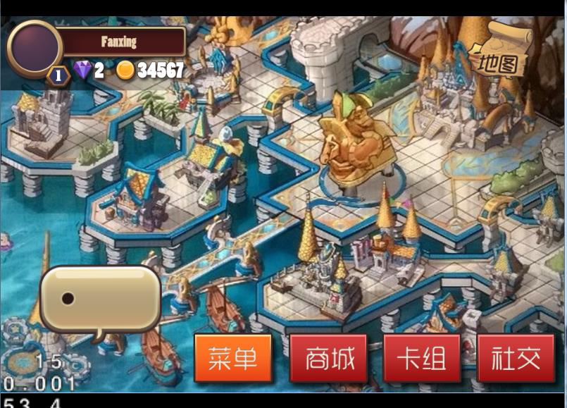
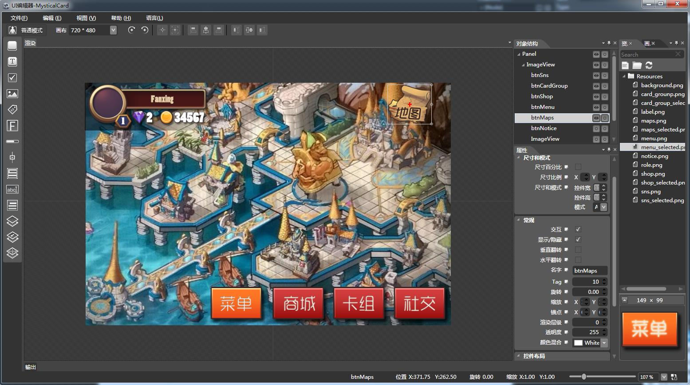
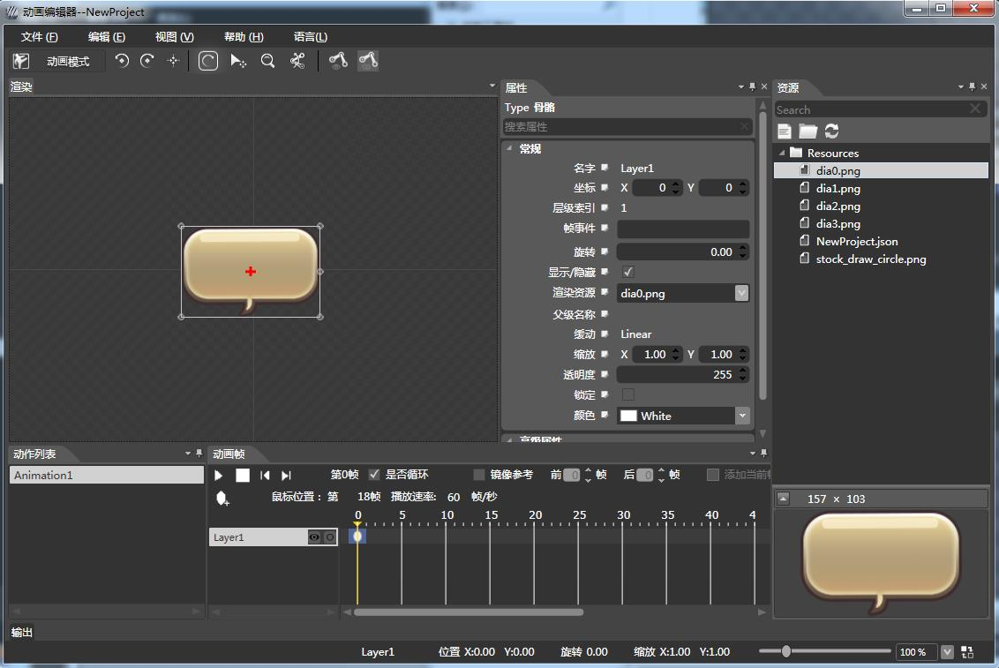
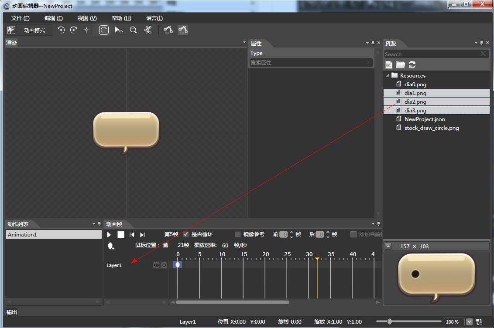
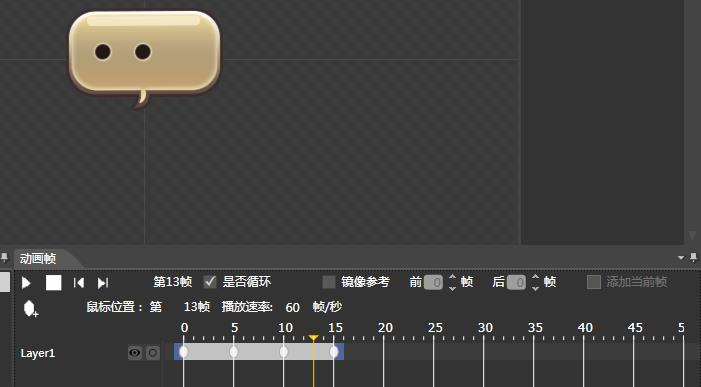
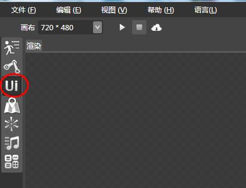
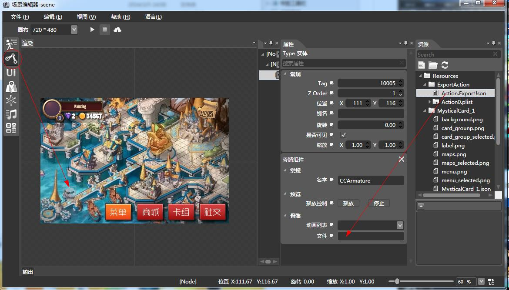
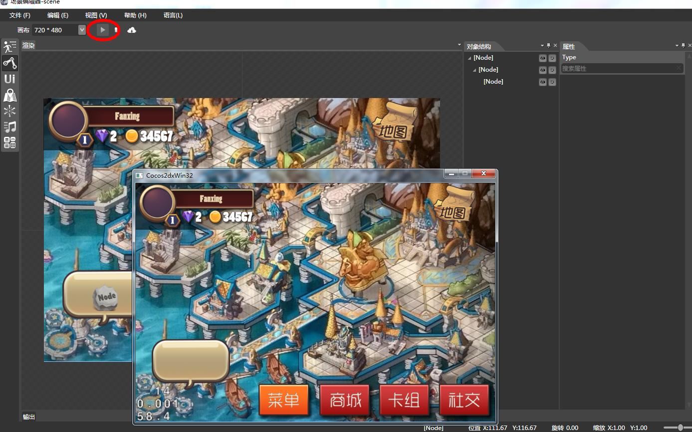
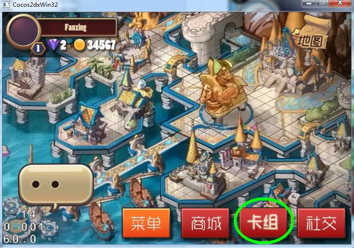
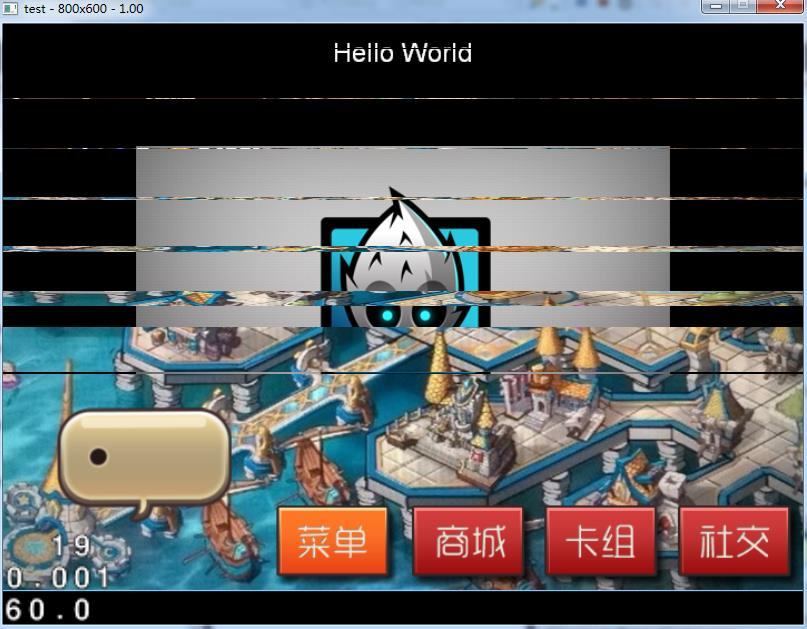

# 怎样用cocostudio制作一个标准的卡牌游戏主界面

版本：cocos2d-x v2.2.2

## Table of Contents

- 1 CocoStudio 场景编辑器
- 2 使用 CocoStudio 完成游戏场景编辑
	- 2.1 UI 编辑器制作游戏主界面
	- 2.2 建立关键帧动画
	- 2.3 场景编辑器的 资源“整合”
- 3 在 Cocos2d-x 中加载场景资源 并运行之
	- 3.1 加载场景内容
	- 3.2 在场景中播放动画
	- 3.3 对场景的一些编码说明

### 1 CocoStudio 场景编辑器

本文将讲解使用 CocoStudio 场景编辑器来创建游戏场景，其中包含游戏 UI 与动画，来定制一个游戏主界面。
### 2 使用 CocoStudio 完成游戏场景编辑

对于环境的搭建使用，请参考之前的文章，或者实时关注 官方 最新版本的安装使用方法。
#### 2.1 UI 编辑器制作游戏主界面

1. 创建项目(项目名称：MysticalCard)，并导入项目 UI 资源，添加 一图片框设定背景图片。注意在工具拦设置 “画布” 的大小（如果需要），这将决定着你的设计分辨率，在运行时还需要注意屏幕的适配问题，如放大缩小，位置偏移等，视具体情况而定。  
          

2. 为界面添加 UI 元素，图片框等，请根据自己的需要定制           

3. 实践过程中的注意事项
	- 添加控件时注意必要的属性设置
	- 控件的命名规范，这有助于我们今后在后台编写代码获取界面元素
	- 可交互的控件的 “可交互属性” 开启

#### 2.2 建立关键帧动画

除了主界面一些必要的 UI 控件，我们还需要一个 “对话框指示” 的动画效果。这是一个帧动画。

1. 准备工作。
	- 打开 CocoStudio ,启动 动画编辑器
	- 创建一个新的项目，后导入资源（在 “资源窗口” 中，点击 “文件” 或者 “文件夹” 标示，添加需要的素材资源）
	- 在 “资源窗口中” 点击关键帧动画的守帧图片，拖动至 “渲染窗口”            
   如下图所示：    
              
           
2. 将第一关键帧拖动至 “渲染窗口” 中心。 可以使用工具栏，快速定位至窗口中心，使图片显示在正中间，可以让动画更好的定位。           
  
        
3. 添加其它帧图片，注意，我们需要选中剩余图片，然后 “拖动” 到 “对象结构” 视图中的 “第一关键帧” 所在的对象，如下图所示。       
关键帧 与 骨骼动画操作区别：在使用骨骼动画的时候，我们将骨骼中的各部分元素，直接拖动添加到 “渲染窗口”，以摆放各骨骼的位置关系，而在 “对象结构” 视图中则表现为，一个列表，标示着每一块骨骼对象，不同帧所改变的是各个骨骼对象的位置，以达到骨骼动画效果。              
而在关键帧动画中，它的对象结构只有一个，而在每一帧修改的不是其位置，而是其显示内容。这是两者之间的区别，那操作方式也有所不同。而对于它们所导出的 资源 则是相同，用法也是同样。             
   
            
4. 剩余帧添加之后，我们看见在 “关键帧” 视图中，已经有了多帧动画，可以播放动画，查看效果。   
    
           
5. 导出动画资源，导出的资源文件可以被我们在 Cocos2d-x 中以代码的方式直接加载，然后播放其动画，也可以作为 场景编辑器中的一个元素，被添加在场景编辑器里，后面的内容就是使用 场景编辑器来加载一个动画的方式。

#### 2.3 场景编辑器的 资源“整合”

使用 CocoStudio 可以很好的帮助游戏开发过程中 分工合作。动画编辑器 和 UI 编辑器可以由多个人进行编辑，最后再由一个人统合资源，这也就是场景编辑器的优点了，它除了能支持 CocoStudio 本身所自带的动画编辑器，UI 编辑器，它还能支持，Tmx 地图资源，粒子编辑器的粒子效果资源，声音资源等～并且不断扩展中。以下将给出如何在 场景编辑器整合我们之前所创建的动画与 UI 界面的资源，来实现我们一个场景的运行效果。它的步骤如下：

1. 启动场景编辑器，新建一个场景项目。并设置 “画布” 大小。画布大小要适量。
2. 我们拖动一个 UI 控件到画布之上，它作为我们之前导出的 UI 资源的承载。   
      
          
3. 我们将之前的 UI 编辑器所导出的资源，导入到当前场景项目中来，导入方式与 UI 编辑器导入资源方式同样，如下图：          

          
4. 为 UI 控件的 “文件” 属性赋值：我们在资源视图中找到 UI 编辑器所导出的 UI 资源，其目录下包含 json 文件资源（如这里的 “MysticalCard_1.json”）,将其拖动到 UI 控件的文件 属性中去，如下图所示：    
        
        
5. 前面的步骤已经将 UI 资源导入场景之内，现在需要添加之前所创建的动画资源。
	- 我们以相同的方式导入动画编辑器所导出的动画资源文件。
	- 拖动一个骨骼控件至场景界面，如下图所示。
	- 为骨骼控件的 “文件” 属性赋值，其值为 动画资源中的 ExportJson（或者 json 文件，这取决于动画资源的导出方式） 文件。          
      
             
6. 运行效果：当我们建立好场景之后，可以通过工具栏运行按钮，点击查看效果，这意味着你不用将所有的资源文件，手动以代码的方式添加到 Cocos2d-x 中，便能看到效果。   

     
在运行效果中，所有的控件都是可操作的，如下图，但这里只有点击效果，如果需要实现其逻辑，那么现在需要将其加载到 Cocos2d-x 项目中，编写后台代码实现。          

          

### 3 在 Cocos2d-x 中加载场景资源 并运行之
#### 3.1 加载场景内容

前面那么多步骤，使用 CocoStudio 来创建了 UI，动画，还有一个场景，而要将其运行在实际的项目中，就非常的简单与方便了，只需几行代码，就能够将其加载到项目中去，当然在这之前我们需要将场景编辑器的资源（场景项目目录中 “Resources” 目录，其中将包含一个 json 文件）复制到项目资源目录中去：

    // 加载场景资源
    CCNode *pNode = SceneReader::sharedSceneReader()->createNodeWithSceneFile("McScene.json");
    this->addChild(pNode);

因为该教程Demo在cocos2d-x-v2.2.2上编译通过，所以不再用 CCJsonReader 来读取解析 json文件了，这里我们通过 SceneReader 来读取解析 json，从而获得场景中的节点内容，直接添加到当前的场景就能运行。
#### 3.2 在场景中播放动画

默认加载的场景资源 动画 组件是没有播放的，需要手动获取动画组件对象，然后调用其播放方法，当然这个步骤也是非常简单的：

    // pNode 为 之前所获取的场景资源根节点，通过此节点获取到动画对象，获取方式根据在场景编辑其中设置的层次关系而定
    CCComRender *pLoadRender = (CCComRender*)(pNode->getChildByTag(1)->getChildByTag(1)->getComponent("CCArmature"));
    CCArmature* armLoad = (CCArmature*)(pLoadRender->getRender());
     
    // 播放动画
    armLoad->getAnimation()->playByIndex(0);

#### 3.3 在场景中获得按钮响应

cocos2dx v2.2.2中，UI库做了以下改变：

- 类名变更，去掉所有类的“UI”前缀； 
- 命名控件变更，所有ui框架类命名控件更改为 cocos2d::gui; 
- 删除UILayer, 由TouchGroup替代；
- UIWidget由CCObject继承改为由CCNodeRGBA继承；  
- 删除原有ListView控件，推荐使用新ListView; 
- Widget::getChildByName不再查找整个结构树，改为只查找一层子节点，UIHelper::seekWidgetByName可查找整个结构树； 
- Widget::addRenderer/Widget::getRenderer已删除，改为Widget::addNode/Widget::getNode; 
- 增添layout裁切模式切换，现有裁切模式为stencil裁切、glscissor裁切，后者效率更高，但不支持旋转； 
- Button功能增添，当没有“按下状态”的图片时，点击Button将自动放大； 
            
同在场景中播放动画一样，我们同样需要手动获得按钮组件，然后为按钮添加相应的触控事件，代码如下：

	//从场景中获取ui按钮控件  
	CCComRender *render = (CCComRender*)(m_pCurNode->getChildByTag(1)->getComponent("GUIComponent"));
	cocos2d::gui::TouchGroup* touchGroup = (cocos2d::gui::TouchGroup*)(render->getNode());
	
	cocos2d::gui::Widget* widget = (cocos2d::gui::Widget*)(touchGroup->getWidgetByName("Panel")->getChildByTag(2));
	//获得名字为btnMenu的按钮，这里为菜单按钮
	cocos2d::gui::UIButton* button = (cocos2d::gui::UIButton*)(widget->getChildByName("btnMenu"));
	
	//为菜单按钮添加触控事件  
	button->addTouchEventListener(this, cocos2d::gui::SEL_TouchEvent(&SceneEditorTestLayer::toExtensionsMainLayer));

按钮回调函数如下：

	void SceneEditorTestLayer::toExtensionsMainLayer(cocos2d::CCObject *sender, cocos2d::gui::TouchEventType type)
	{
		CCScene *pScene = HelloWorld::scene();
		switch (type) {
		case gui::TOUCH_EVENT_ENDED:		
			//当触控事件结束的时候，简单的实现跳转场景（举例说明）
			CCDirector::sharedDirector()->replaceScene(CCTransitionFadeDown::create(2.0f, pScene));
			break;
		default:
			break;
		}
	}
效果如下：          

#### 3.4 对场景的一些编码说明

使用 CocoStudio 就是为了帮助我们快速的建立 UI 原型，然后通过编码可以获取到里面的任意一个元素对象，并修改其属性值，调用其方法，正如上面所示播放一个动画的方法同样。其步骤如下：

- 通过 SceneReader 类读取 json 文件，将会自动解析构建对象，返回一个节点 CCNode
- 任何元素都能通过这个 CCNode 节点，获取到，它其实就是一个树，所不同的是层级关系（树节点的位置）
- 找到需要对象所在的 “树枝”，后通过 getComponent 方法获取 所在的 CCComRender 对象
- 通过 CCComRender 的 getNode 方法获取对象
- 得到我们所需要的具体对象之后，我们就能够对齐进行草，设置属性，调用方法等，诸如此类

本文中所有的源码示例 和 CocoStudio 项目工程都可以在 [这里](./mysticalCard.zip) 查看。
