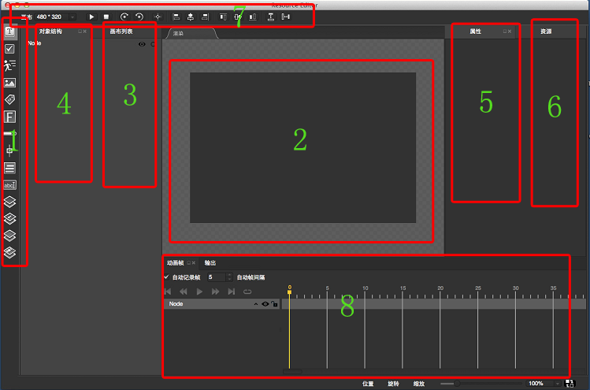
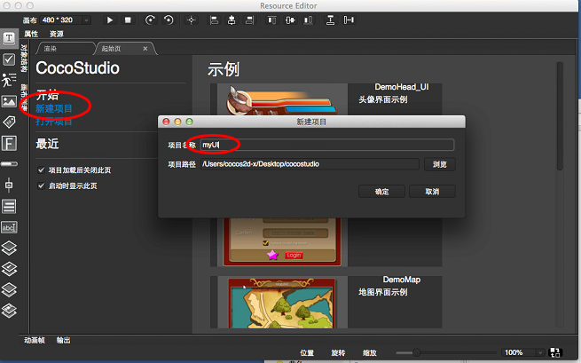
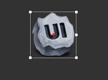
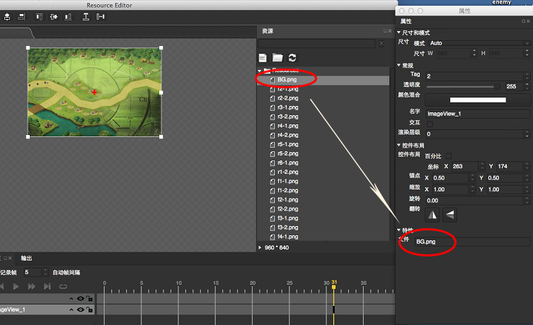
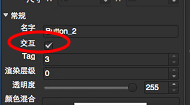
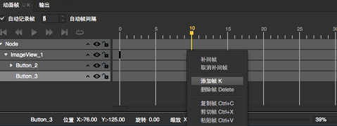
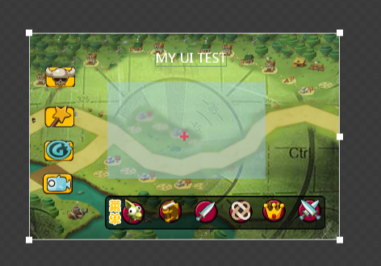

# Mac版 CocoStudio 资源编辑器的使用
## 背景介绍
CocoStudio是由触控科技引擎团队研发的一套基于Cocos2D-X的免费游戏开发工具集，它能帮助开发者快速创建游戏资源，将大部分繁琐的游戏开发工作使用编辑器来快速制作，进一步帮助游戏开发者减短开发周期、提高开发效率。

Win版本的CocoStudio早于Mac版本的CocoStudio发布，前者包含了游戏开发中核心的几个游戏编辑器，分别是UI编辑器、动画编辑器、场景编辑器和数据编辑器，用于处理游戏中的UI界面、动画资源、游戏场景、游戏数据。而就现在发布的Mac CocoStudio的Alpha版而言，它只包含一个资源编辑器（即ResourceEditor）和一个游戏编辑器GameEditor。

## 使用说明
作为基础篇，本文主要介绍Mac版 CocoStudio 中资源编辑器的使用。如上面所述，Win版本的CocoStudio中是没有该编辑器的，但其实这个资源编辑器就等同于Win版本中的UI编辑器，只不过计划会把原Win上的UI编辑器, 动画编辑器合并，现在ResourceEditor里面关键帧编辑就是来至于原动画编辑器。后续的CocoStudio版本中"动画序列帧，关键帧以及UI界面", 都会用ResourceEditor来做。

接下来我们开始进行资源编辑器的学习，首先我们对资源编辑器整体做一个认识，见下图。   

在图中第1部分是控件工具栏面板，其中依次包括文本按钮、复选框、精灵、图片、数字标签、自定义字体、进度条、滑动条、文本区、输入框、层容器、滚动层、列表容器、翻动页面等对象。

第2部分是渲染区域，也就是我们的画布，它是资源布局的主编辑区，在该区域可以对各对象进行移动，缩放，旋转的操作，所有主要的操作结果都会在这个区域中显示完成。

第3部分是画布列表面板，一个项目中可以创建多个画布。

第4部分是对象结构面板，编辑的对象会以树形的层级结构排列显示在该面板。

第5部分是属性面板，当选中一个节点，属性窗口会显示出该节点的所有属性。修改任意属性可以立即改变该节点在渲染区域的状态。

第6部分是资源面板，本项目中使用的所有资源都必须导入到该面板才可以使用。

第7部分是快捷菜单栏，该窗口中有一些常用操作，包括画布大小的设置，对齐方式等等。

第8部分是动画帧面板，这也Win版本的UI编辑器区别于Mac版本资源编辑器最显著的一个部分。该面板将显示画布中所有节点的序列帧，可通过添加帧和设置补间动画创建动画
序列帧。
## 在编辑器中创建界面
本文将结合具体示例介绍资源编辑器的使用，下面是具体过程：

1. 打开 CocoStudio ResourceEditor 编辑器，创建一个新的项目（例：myUI 项目）。   
  
2. 在快捷菜单栏中设置画布大小，也可根据具体情况自定义分辨率大小。
3. 选择 文件->导入资源 导入所需的资源文件，也可直接将资源拷入myUI/Resources文件夹目录下，然后刷新资源面板。    

4. 接下来是一个大家随意发挥的过程，根据需求任意拖动控件工具栏面板中所需要的控件到画布上。     
如添加一个图片控件的步骤：
	- 选中控件工具栏中的图片，拖拽到画布，使图片控件处于选中状态，如下图所示：      
	 
	- 打开属性窗口，并将窗口拉伸到足够的高度以显示完整的属性列表，然后将资源窗口中的图片资源拖拽到文件属性栏。     
	 
	- 设置相应的属性，如描点、坐标值、标示等等。 
	>   
其他控件的添加类似，就不一一介绍了。      
另外注意一点，如果添加的是按钮控件，并且这个按钮是有交互效果的，那么在 属性 –> 常规 -> 交互 的选项要勾选，这样才能使用在输出数据中启动控件的鼠标事件响应；否则将没有点击效果。如图：
 
5. 如果需要在界面中添加动画，则选中相应控件，在适当的地方添加关键帧或补间帧，改变它们的属性，就可以实现不连续的或连续的动画。
 
6. 导出项目为程序可用的资源。同Win版本的UI编辑器一样，资源编辑器是支持碎图合并功能的，它可以把用到了图合并成一张，这样的话，在程序里面的运行效率会比较高。导出的几个资源文件在项目myUI/Export/myUI_1 中，包含三个导出的资源文件 ：myUI_1.ExportJson, myUI0.plist, myUI0.png       
 

## 总结

总体来说，通过CocoStudio进行可视化编辑为游戏开发者提供了很大的方便，不过，Mac版的CocoStudio目前还并不完善，在使用过程中出现过一些Bug，这些是亟待解决的问题。

