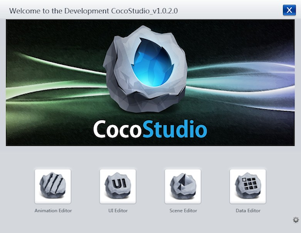

# What is CocoStudio

CocoStudio는 Cocos2d-x를 기반으로 한 전문적인 게임 개발 툴이며, 평생 무료로 제공됩니다. 또한, CocoStudio가 제공하는 UI 에디터, 애니메이션 에디터, 씬 에디터, 데이터 에디터를 이용하면, 개발 과정 중 재미 없는 부분인 리소스 제작 및 배치를 빠르고 간단하게 끝낼 수 있습니다. 이 네 툴은 게임 개발에 있어서 핵심적인 부분인 애니메이션, UI, 게임 씬, 게임 데이터들을 모두 커버하며, 각 툴들은 해당하는 분야에 특화되도록 디자인되었기에 누구나 실수 없이 효율적으로 작업할 수 있습니다. 간단히 말하자면, CocoStudio는 여러분이 적은 비용으로 높은 생산성을 얻도록 도와줄 것입니다.

*그림 1: CocoStudio*

CocoStudio는 즉흥적으로 만들어진게 아닙니다. 2012년, 저희는 FishJoy2를 개발할 때 많은 문제점들에 봉착하게 되었습니다. Cocos2d-x는 시각적인 툴이 전무했기에 프로그래머들은 디자이너의 요구에 맞게 UI나 애니메이션을 배치하기 위해서 오랜 시간동안 삽질을 해야 했던 것이죠. 그래서 저희들은 이 문제를 해결하기 위한 시각적인 툴의 개발을 고려하게 되었습니다. 그렇게 개발된 툴이 FishJoy2 개발을 지원하기 위해 만들어진 SP-II입니다. 반년 후, 저희는 이 툴을 가공해 2013년 4월, 정식 배포하게 되는데, 그것이 바로 CocoStudio입니다.

## UI 에디터

UI 에디터는 모든 그래픽 인터페이스를 수정할 수 있는 툴입니다. 대부분의 경우 아트 디자이너들이 사용하게 되겠죠. 이 툴을 이용하면 미리 준비한 각종 인터페이스 이미지를 불러와 배치하고, 오브젝트끼리 결합시키고, 조명이나 여러 사물들의 구도를 조정할 수 있습니다. 그리고 이것들을 내보내서 게임 코드와 직접 연결시킬 수 있습니다. UI 에디터는 Cocos2d-x의 모든 플러그인과 이것들의 확장, 그리고 개발 과정에 있는 다양한 목적의 UI 플러그인들을 안정적으로 처리할 수 있습니다. 또한 이 툴은 개별 이미지, 혹은 전체적인 이미지를 내보내거나 UI 템플릿, UI 애니메이션 및 기타 실용적인 목적에도 도움을 줄 수 있습니다.

## 애니메이션 에디터

애니메이션 에디터는 캐릭터 동작이나 특별한 이펙트 애니메이션, 씬 애니메이션 등 게임 내부의 동적인 리소스들을 제작하고 편집할 수 있는 툴입니다. 아트 디자이너들이 다른 사람들보다 더 자주 사용하게 되겠죠. 준비된 이미지를 툴로 불러온 다음, 다양한 애니메이션 효과들을 적용하고, 구도를 디자인하고, 툴 내에서 미리 확인해볼 수 있습니다. 이 툴은 키프레임 애니메이션, 연속 프레임 애니메이션, 스켈레톤 애니메이션 등을 지원합니다. 또한 이 툴은 단순한 이미지 이외에, 플래시나 포토샵 파일, 혹은 스프라이트 시트도 불러올 수 있습니다.

## 씬 에디터

씬의 구성요소들을 편집하거나 게임 레벨디자인에 사용되는 툴입니다. 이 툴이 있으면 기획자는 애니메이션, UI, 타일맵, 파티클,
이미지, 사운드 등 다양한 게임 리소스들을 조합하고 배치할 수 있습니다. 심지어 이 툴은 충돌영역, 트리거, 컨트롤러와 같은 논리적인 리소스들도 편집할 수 있습니다. 또한, 이 툴은 시뮬레이션 기능도 포함하는데, 현재 씬을 시뮬레이터를 이용해 구동하거나 무선 연결을 통해 단말기에서 직접 구동시킬 수도 있습니다.

## 데이터 에디터

데이터 디자이너는 복잡한 변수 테이블(엑셀 등)을 단순화해 일반적인 데이터 포맷(JSON 등)으로 내보낼 수 있습니다. 데이터 형식은 데이터 매니저를 통해 선택할 수 있습니다.
